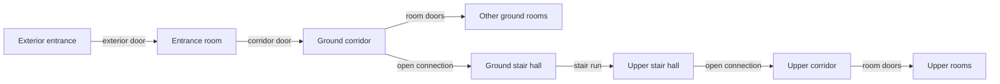

# Architecture planner

## Status and boundary

`@worldwright/architecture-planner` is the Milestone 2 offline bridge between semantic intent and
the existing Roblox primitive compiler. It plans a coherent orthogonal blockout from a constrained
WorldSpec architectural program. It does not understand images, call an AI provider, generate
meshes, connect to Roblox Studio, or mutate a place.

```mermaid
flowchart LR
    Unknown["Unknown JSON value"]
    WS["Validated WorldSpec 0.1.0<br/>canonical semantic source"]
    Profile["Architecture source profile<br/>strict directives"]
    Solver["Integer-grid planner<br/>bounded beam width 256"]
    Plan["Architecture Plan 0.1.0<br/>reviewable layout and graph"]
    Eval["Independent semantic evaluation"]
    Derived["Derived WorldSpec 0.1.0<br/>semantic and primitive entities"]
    Compiler["Roblox compiler 0.1.0<br/>desired Manifest"]
    Future["Future Forge and Studio boundary"]

    Unknown --> WS --> Profile --> Solver --> Plan --> Eval --> Derived --> Compiler
    Compiler -. "not implemented" .-> Future

    classDef current fill:#d9f5e5,stroke:#176b3a,stroke-width:2px,color:#102a1c;
    classDef future fill:#f4f4f5,stroke:#71717a,stroke-dasharray:5 4,color:#27272a;
    class WS,Profile,Solver,Plan,Eval,Derived,Compiler current;
    class Future future;
```



The plan and derived WorldSpec are deterministic JSON artifacts. The desired Roblox Manifest is
still offline desired state. None of these artifacts authorizes or performs a live mutation.

## Source profile

The v0.1 planner accepts the following supported subset after normal WorldSpec schema and semantic
validation:

- one `world` root with optional `region` and `parcel` ancestors;
- exactly one `structure` carrying a building directive;
- one through three `floor` children directly beneath that structure, at contiguous levels starting
  at zero;
- between two and 32 `room` children directly beneath every floor;
- exactly one entrance room, on level zero;
- exactly one `route` child carrying a stair directive when the building has multiple floors; and
- up to 512 room-to-room `adjacent_to` relationships carrying strict architecture directives.

Unsupported descendants inside the selected structure fail instead of disappearing. The building is
selected by its directive, never its display name or array position. Room programs come from room
directives, never tags or prose inference.

The source must not contain `worldwright.roblox` attributes. The planner owns the complete derived
Roblox representation and will not overwrite a pre-authored directive. IDs in every WorldSpec ID
domain beginning with the reserved `archgen-` prefix are rejected. Locks that target the planned
building are rejected because WorldSpec field-path lock execution is not yet defined. A supported
reachability constraint has non-empty room-only subject and target sets and no parameters; the plan
evaluator proves every requested pair through the explicit circulation graph. Unsupported
error-severity constraints affecting the building fail. Unsupported warning constraints are
preserved with a warning that they were not evaluated.

## Directive extraction

Entity directives live at `entity.attributes["worldwright.architecture"]`. A strict discriminated
union allows `building` only on the selected structure, `floor` only on its direct floor children,
`room` only on direct room children, and `stair` only on the one direct route child. Relationship
directives use the same key under an undirected room-to-room `adjacent_to` relationship and must use
mode `adjacency`. An unordered room pair may carry at most one valid architecture adjacency
directive across `door`, `near`, and `none`; duplicate and conflicting directives are rejected in
canonical relationship-ID order.

Extraction is a trust boundary:

1. validate the entire source as JSON-compatible WorldSpec;
2. normalize it without mutating the caller;
3. reject more than 512 architecture relationship directives before parsing any directive;
4. locate the unique building directive;
5. validate each directive against its closed TypeBox schema;
6. validate kind, parent, floor, entrance, stair, relationship, lock, constraint, and reserved-ID
   invariants; and
7. compute SHA-256 over canonical `stringifyWorldSpec` output.

Unknown directive fields and unsupported versions are errors. Relationships without an architecture
directive are retained as source semantics but do not affect the v0.1 solver.

## Coordinates and the integer grid

The outer footprint is centered at local `X = 0, Z = 0`. The building directive supplies a world
origin and a quarter-turn yaw. Horizontal planning runs in integer grid cells; aligned stud values
are divided by `gridSize`, checked as safe integers, and converted back only after a candidate is
chosen.

For corridor axis `x`, the corridor runs from negative to positive local X. For axis `z`, it runs
from negative to positive local Z. `entranceEnd` selects the public end along that axis. The
corridor spans the full interior-envelope length and is centered across the perpendicular dimension.
The two corridor wall thicknesses and clear corridor width are subtracted before the remaining clear
width is split into room bands. At least two grid cells must remain so each band is positive. If the
split has one extra cell, the canonical candidate rule assigns it rather than discarding it.

Room, corridor, and stair rectangles describe clear space between wall faces. The outer footprint
describes exterior wall faces. Walls and slabs occupy their own volume and are never hidden inside
room rectangles. Every floor clear height must be at least the default door height and at least the
default window sill height plus default window height.

World-space emission uses exact quarter-turn mappings, not trigonometry:

| Yaw | World X            | World Z            |
| --- | ------------------ | ------------------ |
| 0   | `originX + localX` | `originZ + localZ` |
| 90  | `originX - localZ` | `originZ + localX` |
| 180 | `originX - localX` | `originZ - localZ` |
| 270 | `originX + localZ` | `originZ - localX` |

Primitive transforms follow the Roblox compiler's world-space contract. Parent container transforms
do not compose into descendants.

## Search candidates

The planner implements only `double_loaded_spine`. A global candidate fixes:

- corridor axis (`x` and `z` are both evaluated when the directive says `auto`);
- stair side (`negative` and `positive` are both evaluated when set to `auto`); and
- the deterministic choice for any unequal one-cell band split.

The aligned stair core is placed at the rear, opposite the entrance end, on the same side and in the
same local rectangle on every floor. It is shifted away from the corridor wall by exactly one
`defaultDoorWidth`, retaining a floor-level access lane inside the stair hall. The centered
corridor-to-hall opening enters that lane, which provides a clear side route to the first or final
tread instead of forcing entry onto a raised mid-run step.

For each floor and global candidate, rooms begin in this canonical order:

1. required adjacency degree, descending;
2. minimum area, descending; and
3. source ID, Unicode code-point order.

A bounded beam search assigns the next room to either band and to either the entrance-facing or
rear-facing sequence end. The entrance room is forced to the entrance-facing end of one ground-floor
sequence. States whose remaining minimum lengths cannot fit are pruned. The beam retains at most 256
partial states after sorting by the absolute difference between the two bands' assigned
preferred-minus-minimum length slack, then canonical signature. This deterministic capacity-balance
heuristic is not an admissible lower bound on final primary score. The seed tie key is excluded from
partial pruning and is considered only after complete plans have identical non-seed score
components. Search is finite and contains no random or time-dependent step.

The fixed bound makes planning practical and repeatable, but it is not a proof of global optimality.
An unusually adversarial feasible program can fall outside the retained frontier and be reported
infeasible.

Room maximum-area and maximum-aspect limits are permissive upper bounds. Values beyond the supported
4,096-cell band length are clamped to that capacity before allocation, so widening an upper bound
cannot make a previously feasible program fail.

The exact v0.1 work limits are part of the deterministic contract:

| Work dimension                         | Limit       |
| -------------------------------------- | ----------- |
| Floors                                 | 3           |
| Rooms per floor                        | 32          |
| Architecture relationship directives   | 512         |
| Architecture Plan spaces               | 102         |
| Architecture Plan logical walls        | 309         |
| Architecture Plan openings             | 6,756       |
| Architecture Plan stair runs           | 2           |
| Architecture Plan circulation edges    | 614         |
| Along-band grid length                 | 4,096 cells |
| Beam states retained                   | 256         |
| Complete candidates retained per floor | 64          |
| Global floor combinations evaluated    | 512         |
| Windows requested per room             | 64          |
| Steps expanded per stair run           | 256         |
| Generated entities                     | 16,384      |
| Generated primitives                   | 12,288      |

Window and stair caps are rejected during directive/profile validation. Exact selected-plan entity
and primitive counts are checked before the emitter expands generated WorldSpec entities.

## Room allocation

Once a candidate fixes each sequence and side, allocation operates in cells:

1. derive the minimum feasible along-corridor length from minimum area, minimum span, aspect-ratio
   limits, and the fixed band depth;
2. reserve divider thicknesses and the stair reservation from side capacity;
3. give every room its minimum feasible length;
4. distribute cells toward preferred areas using deterministic largest-deficit ordering;
5. distribute remaining cells without exceeding maximum areas, with source ID as the final tie
   break; and
6. reject the candidate unless the authored rooms exactly tile each available band sequence.

A room must remain inside the envelope, not overlap another room, touch both its corridor wall and
the exterior side of its band, satisfy its area and span ranges, satisfy its aspect-ratio ceiling,
and leave enough wall length for required openings. The planner does not invent filler rooms or hide
unexplained voids.

Two rooms are directly adjacent only when consecutive clear rectangles share a non-zero divider
segment. Rooms opposite each other across the corridor are not directly adjacent.

For corridor length `L` in grid cells, near relationships use threshold `T = max(1, floor(L / 2))`.
Evaluation avoids fractional centroids by comparing doubled-cell Manhattan distance
`D2 = abs((2x1 + w1) - (2x2 + w2)) + abs((2z1 + d1) - (2z2 + d2)) + 2 * abs(level1 - level2) * L`
with `2T`. `required + near` is a hard rule and emits `architecture.required_adjacency_unsatisfied`
when `D2 > 2T`; it creates no opening. Every near directive also contributes `D2 * weight` to the
deterministic near-distance score.

## Scoring and seed behavior

Hard-rule failures reject a candidate. Feasible candidates receive non-negative integer penalties
for:

- deviation from preferred room area;
- undesirable allowed aspect ratios;
- unsatisfied preferred-door adjacency;
- weighted centroid distance for every near relationship;
- public rooms too far from the entrance;
- private rooms too near the entrance;
- service rooms too far from the rear and stair;
- preferred windows that do not fit beyond the minimum; and
- a non-preferred corridor-axis alternative when otherwise equivalent.

The plan records each component and the primary total. `score.preferredWindows` is the sum, across
rooms, of `max(0, preferred window count - fitting exterior window count)` and is included in
`score.total`. Corridor-axis preference is included in `score.zoneOrdering`. A SHA-256 key derived
from the project seed and canonical candidate signature resolves only exact primary-score ties.
Every component and the primary total use incremental saturation at the maximum safe integer,
`9007199254740991`; candidate ordering never accumulates an unsafe larger integer. The seed cannot
let a worse candidate defeat a better primary score. Important unmet soft preferences become
warnings, not undocumented hard failures.

## Logical walls

Walls are generated from the selected clear-space topology before physical wall parts exist. The
planner emits exterior perimeter segments, corridor-to-room walls, room dividers, stair-core
boundaries, and corridor end walls. Each segment has canonical orientation: an `x` wall has
`start < end` along positive local X at constant Z, while a `z` wall uses positive local Z at
constant X.

Segments are split at meaningful space boundaries, canonicalized, and deduplicated by geometry and
adjacency identity. Overlapping conflicting segments fail. A logical wall names its floor, kind,
axis, constant coordinate, interval, thickness, height, adjacent spaces, exterior status, and
ordered opening IDs.

After openings are validated, the emitter subtracts their intervals into Roblox wall panels. It
emits full-height panels between openings, a lower panel beneath a raised opening, and an upper
lintel above an opening whose top is below wall height. Zero-sized parts are omitted. Coverage must
equal logical wall area minus opening area, and panels must neither overlap nor change wall
thickness.

## Openings

Every room receives exactly one door in its corridor wall. The room's optional `doorWidth` overrides
the building default. Placement begins centered and moves only by a deterministic rule to maintain
end clearance and avoid conflicts.

The entrance room receives one exterior door on its entrance-end facade. A satisfied required or
preferred `door` relationship receives one centered opening in the rooms' shared divider. A `near`
relationship never creates an opening, and an `avoid` relationship forbids a shared divider.

Each room owns an exterior logical wall segment. The planner places the minimum window count first
and then evenly distributes as many preferred windows as fit. Windows respect horizontal end
clearance, other openings, sill height, opening height, and wall height. A missing minimum window is
a hard failure; a missing preferred window is a warning. Both authored window counts are bounded at
64 per room before opening expansion.

Door openings remain empty. Each window receives one non-collidable, non-touchable, queryable Glass
Part using the configured material, color, and transparency. Window panes use the fixed v0.1 rule
`castShadow: false`. Milestone 2 generates no moving doors, scripts, assets, textures, or arbitrary
properties.

## Slabs and stairs

Finished-floor elevation is the top of a slab. A slab extends downward by `slabThickness`. The
lowest floor has a complete outer-footprint slab. Its starting landing is a separate primitive
placed directly above that slab, so the two solids only touch at the finished-floor plane. Every
upper floor subtracts the complete stair core and decomposes the remainder into positive,
non-overlapping slab panels. The retained arrival landing is emitted separately inside the opening,
flush with the upper slab surface, and is never also emitted as a slab panel. A three-floor shared
arrival/departure rectangle is emitted once for that floor and rectangle.

One stair run joins each pair of adjacent floor levels. For rise `R`:

```text
stepCount   = ceil(R / maximumRiserHeight)
riserHeight = R / stepCount
landingDepth = max(minimumTreadDepth, min(coreLength / 4, 2))
availableRunLength = coreLength - 2 * landingDepth
treadDepth  = availableRunLength / stepCount
```

The step count must be positive and at most 256, the riser must not exceed its maximum, the tread
must meet its minimum, and the run, clear width, and landing must fit the aligned core. The output
uses anchored Block Parts for steps and landings. These are traversable blockout approximations, not
claims of building-code compliance or Studio-tested character traversal.

## Explicit circulation

The plan contains an undirected navigation graph. Nodes cover the exterior entrance, every room,
each corridor, every stair hall, and floor-to-floor stair connections. Edges arise only from an
opening or stair run:



An iterative graph search starts at the exterior node. Every room, corridor, stair hall, and floor
must be reached. Geometry that merely touches does not create an edge.

## Plan evaluation

Architecture Plan schema validation is only the first evaluation phase. Semantic evaluation checks
source and plan identity, floor and room coverage, positive and grid-aligned rectangles,
containment, non-overlap, exact band tiling, room ranges, corridor continuity, stair alignment,
required and avoided adjacency, unique walls, wall metadata, opening resolution and bounds,
non-overlap, exterior-only windows, circulation integrity, reachability, exact metrics, exact score,
estimated output counts, and deterministic ordering.

The evaluator accepts `unknown`, returns stable structured diagnostics, and never mutates its input.
Emission runs it again rather than trusting a plan merely because it came from the planner. A plan
hash proves integrity of canonical bytes; it is not authentication, authorization, or a signature.

## WorldSpec emission

Emission validates the source and plan, recomputes the canonical source hash, rejects a stale or
unrelated plan, and performs complete semantic plan evaluation. It then creates a deep-independent
WorldSpec while preserving project intent, references, style, budgets, semantic IDs, names,
provenance, tags, relationships, supported constraints, and locks.

Every preserved source entity receives a fixed container directive for the existing Roblox compiler.
Generated semantic entities represent corridors, stair halls, openings, logical-wall groups, slab
groups, and stair runs. Every physical wall panel, slab panel, window pane, step, and landing is one
generated primitive entity with a world-space transform, positive bounds, strict allowlisted
compiler directive, architecture linkage, and an `archgen-` ID.

Generated IDs derive from stable semantic identity and role rather than array position. Readable IDs
that would exceed 128 characters are truncated with a lowercase SHA-256 fragment, and collision
resolution remains deterministic. All generated geometry uses `invented` provenance with notes that
identify deterministic blockout output; relevant source reference IDs may be retained without
misrepresenting hidden geometry as observed.

The planned structure receives compact result metadata with the source WorldSpec hash and
Architecture Plan hash. The entire plan is not copied into WorldSpec. Emission rejects a compiled
entity count above `budgets.limits.instances`. Independently of that optional budget, exact
preflight counts reject more than 16,384 generated entities or 12,288 generated primitives before
entity expansion begins.

## Compiler integration

The derived document is validated through the public `@worldwright/worldspec` API and compiled
through the public `@worldwright/roblox-compiler` API. Compilation must succeed without error
diagnostics before emission reports success. Triangle and texture-memory limits remain unevaluated
where the primitive compiler cannot measure them; its warnings are preserved and are not presented
as passing measurements.

An end-to-end offline caller may continue from the Manifest to the compiler's reconciler and pure
simulator. That proves a deterministic create-from-empty transition as data. It does not apply the
change set to Studio.

## Trust boundaries

| Boundary                          | Required checks                                                                                                      |
| --------------------------------- | -------------------------------------------------------------------------------------------------------------------- |
| Unknown value to WorldSpec        | Plain JSON compatibility, closed schema, semantic graph, canonical independent value                                 |
| WorldSpec to planner profile      | Strict directive schemas, kind and parent placement, unique building and entrance, stair, locks, constraints         |
| Solver state to Architecture Plan | Safe integer arithmetic, bounded search, canonical ordering, hard-rule evaluation                                    |
| Unknown plan to evaluator         | Closed schema plus independent geometry, opening, circulation, metric, score, count, and ordering checks             |
| Source plus plan to emission      | Exact canonical source hash, complete re-evaluation, reserved IDs, collision checks, expansion caps, instance budget |
| Derived WorldSpec to compiler     | WorldSpec validation, strict compiler allowlists, successful pure compilation                                        |
| Manifest to any future live tool  | Not implemented; future authorization, fresh observation, unmanaged-content protection, and transaction protocol     |

The planner performs no dynamic evaluation, network call, shell composition, system-time read, or
random generation. Contracts contain JSON data only. No credentials, executable source, content URLs
in Roblox directives, arbitrary Roblox class, or arbitrary Roblox property crosses the emission
boundary.

## Limitations

Planner v0.1 intentionally does not support:

- more than one planned building or more than three floors;
- basements, negative levels, split levels, mezzanines, or multiple stair cores;
- corridors other than one centered straight double-loaded spine;
- non-rectangular footprints or rooms, curved walls, courtyards, wings, or terrain adaptation;
- room placement that does not touch both the corridor and an exterior band edge;
- elevators, ramps, accessible-route certification, building-code analysis, structural analysis,
  fire egress analysis, or engine-tested character traversal;
- roofs, facade ornament, furniture, lighting fixtures, gameplay systems, scripts, meshes, terrain,
  assets, textures, decals, or polished visual art;
- creator authorization or live Roblox Studio integration; or
- Atlas, learned generation, reference-image understanding, Forge review, The Critic, deployment,
  databases, authentication, telemetry, or analytics.

The mansion fixture is an architectural program and the output is a coherent blockout. It is not a
finished mansion or a claim about unobserved reference geometry.

## Future expansion

New topologies should arrive as separately versioned directive and plan variants with explicit
coordinate, wall, opening, circulation, scoring, and migration semantics. Candidate expansion must
remain bounded and deterministic where this planner claims reproducibility.

Reference-image constraints may later be produced by an evidence-aware system, but they must enter
through WorldSpec with honest provenance and must not bypass planner validation. A learned system
may propose programs or candidate priorities; it must not silently change the score or seed meaning
of `0.1.0`.

Forge may later display the Architecture Plan, score tradeoffs, warnings, logical walls, and a
dry-run Roblox Change Set for creator review. Any live adapter remains a separate trust boundary and
must preserve exact source/plan provenance plus the compiler's fresh-snapshot and
verified-transaction rules.

See [Architecture Planner 0.1 reference](../architecture-planner/0.1.0.md) for the versioned fields,
diagnostics, CLI, and canonical contract behavior.
