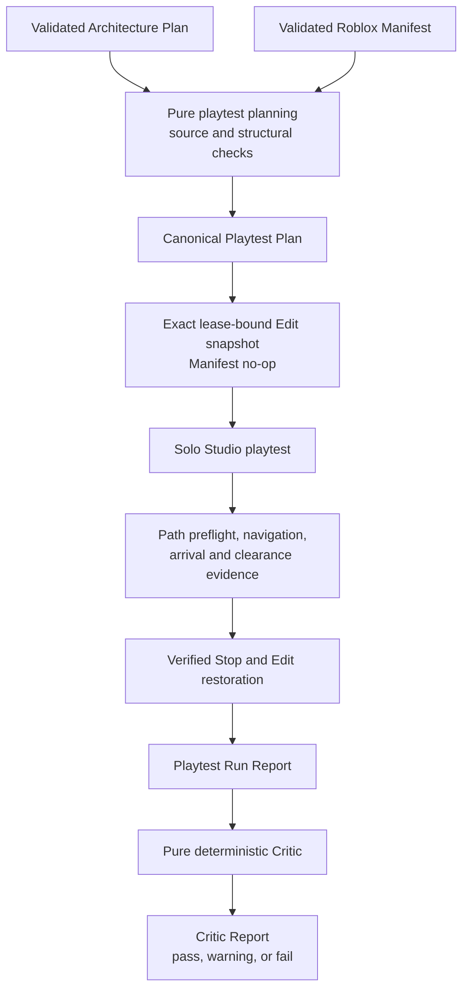

# Playtest observation and Critic architecture

## Implemented scope

Milestone 5 adds Worldwright's first deterministic build-test-evaluate loop. The pure
`@worldwright/playtest-critic` package owns planning, strict reports, normalization, hashing, and
evaluation. The Studio adapter owns the privileged local playtest transport. The boundary evaluates
architectural reachability, character arrival, elementary clearance, floor and stair connectivity,
falls, death, console regressions, evidence completeness, and post-play Edit integrity.

It does not evaluate aesthetics, reference fidelity, lighting, furnishing, gameplay quality,
performance under load, accessibility compliance, or publication readiness. It generates no repair.

## Package ownership

`@worldwright/playtest-critic` depends only on the public WorldSpec, Roblox compiler, and
Architecture Planner packages. Its evaluator has no MCP SDK or Studio dependency. It owns:

- the Playtest Plan, Run Report, and Critic Report schemas;
- deterministic source checks, checkpoint derivation, graph construction, and routing;
- canonical normalization, serialization, validation, and hashing;
- exact coverage and metric recomputation; and
- closed finding rules, messages, severities, categories, suggestions, and ordering.

`@worldwright/studio-mcp-adapter` owns runtime capability discovery, exact Studio selection,
lease-bound Edit verification, the fixed Server probe protocol, start and Stop state machines,
character navigation, bounded console collection, image capture, and construction of observed run
evidence. It does not decide Critic status.

The core compiler transaction adapter remains usable when playtest-specific MCP tools are absent.

## Source binding and proof boundary

Planning receives one validated Architecture Plan `0.1.0` and one validated Roblox Manifest `0.1.0`.
It normalizes and hashes both and records both exact hashes in the Playtest Plan. It also requires
matching project identity, the expected Manifest root and managed count, exact Manifest root source
metadata, and complete semantic and geometry correspondence for rooms, floors, corridors, openings,
walls, stair halls, and stair runs.

This rejects stale, unrelated, or merely visually similar Manifests. Stable semantic and generated
IDs, parentage, class, engine properties, and expected geometry are identity evidence; display names
are not.

The two input hashes intentionally describe different source stages. The Architecture Plan source
hash names the authored WorldSpec, while the Manifest source hash names the emitted derived
WorldSpec. Because the closed Manifest contract does not carry the Architecture Plan hash or the
authored source hash, this pair cannot cryptographically prove Plan-to-Manifest derivation. Version
`0.1.0` fails closed on every correspondence it can prove and accurately describes the result as
exact artifact binding plus structural correspondence.

## Coordinates and checkpoints

Checkpoint coordinates are derived offline from Architecture Plan clear geometry, never invented
from the live viewport. Local horizontal coordinates use the plan's footprint-centered frame. World
conversion uses the planner's exact quarter-turn mapping for yaw `0`, `90`, `180`, and `270`; it
does not use trigonometric approximation. Character-root Y is the expected finished-floor elevation
plus the fixed root-height offset.

Version `0.1.0` derives checkpoint variants for:

- the exterior side of the entrance;
- each relevant opening threshold;
- every room center;
- corridor positions associated with explicit openings;
- stair halls on participating floors; and
- the lower and upper clear landing regions of every stair run.

Generation verifies the point remains inside its intended clear region and outside wall, pane, slab,
step, blocked-edge, and wrong-floor volume. Failure to construct a safe point is a planning error,
not permission to guess a nearby point in Studio.

## Route construction

The planner builds adjacency maps from explicit Architecture Plan circulation nodes and edges plus
their derived checkpoint chains. An opening or stair edge may connect the room center, threshold
points, corridor or stair-hall point, and landing needed to exercise that semantic connection.
Rectangle contact alone creates no graph edge.

Required targets are visited in this order:

1. exterior entrance;
2. entrance room;
3. floor level ascending;
4. public, then service, then private rooms on one floor; and
5. source room ID in Unicode code-point order within a category.

For each next target, iterative breadth-first search visits neighbors in code-point ID order and
selects the deterministic shortest graph route. Only consecutive duplicate checkpoints are removed.
Returning through a corridor or stair remains in the route when needed. Every segment retains its
source circulation edge and exact traversal type.

## Capability discovery

The playtest controller performs a separate handshake for the current Studio MCP tool schemas. It
requires `list_roblox_studios`, `set_active_studio`, `get_studio_state`, `start_stop_play`,
`get_console_output`, `character_navigation`, `screen_capture`, and `execute_luau`. It validates the
actual discovered input schemas, including exact world-position navigation and Edit and Server
data-model support. It never guesses undocumented argument names or values and never exposes a
generic tool-call API.

The [Studio MCP documentation](https://create.roblox.com/docs/studio/mcp) is discovery guidance, not
a substitute for runtime schema validation.

## Exact Studio and lease binding

Before Play, the controller requires:

- the exact privately supplied Studio ID;
- `PlaceId == 0` and `GameId == 0`;
- stopped Edit mode;
- the complete private sandbox lease record reconstructed from the supplied lease ID, plan project,
  and last applied Change Set hash;
- one same-call `bound_snapshot` proving that lease and returning complete managed state;
- exact equality with the desired Manifest through a zero-operation reconciliation; and
- the complete confirmed Playtest Plan SHA-256.

The Studio ID selects a Studio process but is not sufficient DataModel identity. The private lease,
exact root/source/count identity, and complete snapshot are all required. The controller performs no
Edit mutation during this verification or during the run.

## Play start and identity

The normal path sends one start request and polls bounded Studio state until Play and the Server
data model are observed. A fixed Server `identity_probe` verifies the original lease, project,
Manifest root, source hash, managed count, play-running state, and character count without returning
private identity.

An uncertain start poisons the affected connection when appropriate and reconnects through the
default local-stdio policy. If Studio is still Edit, the run fails without a second start. If Studio
is playing, Worldwright continues only after the exact Server identity probe passes. It neither
navigates nor automatically stops an unverified play session that may belong to another actor.

## Character readiness and setup

Bounded fixed probes require exactly one Player, one Character, a Humanoid, a HumanoidRootPart, and
positive health. Player name, user ID, account identity, descendant names, and arbitrary properties
never enter a report.

The single fixed setup action pivots the ready character to the exact exterior setup position, zeros
linear and angular assembly velocity, and rereads position. It cannot create an Instance, write a
script or attribute, anchor the character, change health, change the lease, or mutate architecture.
Setup evidence is retained but excluded from the traversal score.

## Segment execution

Each segment follows one fixed sequence:

1. observe player state and require a living character;
2. run one Server `path_probe` with the fixed agent profile;
3. stop traversal if no successful non-jumping path exists;
4. issue `character_navigation` once for the exact target position;
5. poll bounded independent player state until arrival, timeout, death, or fall;
6. run one read-only clearance probe after arrival;
7. record normalized evidence; and
8. capture the viewport only when the target belongs to the bounded capture set.

Path preflight uses PathfindingService and retains bounded count, distance, jump, and digest
evidence. It creates no waypoint Parts and retains no Path object. Navigation acknowledgment does
not establish arrival. When the navigation response is uncertain, independent state can prove
arrival, but the same navigation request is never sent again.

Arrival checks horizontal and vertical tolerances separately, final velocity, health, humanoid
state, expected floor, support, and allowed fall range. The clearance probe uses bounded downward
support and body/head spatial queries, excludes the character, returns only managed blocker IDs and
an unmanaged blocker count, and does not alter collision state.

## Console and viewport evidence

Console collection uses a narrow wrapper around the discovered result shape. One bounded baseline is
observed before Play, one bounded final observation occurs while the run remains identifiable, and a
bounded post-Stop observation may be retained where supported. Entry count, entry bytes, total
bytes, severity, and source are limited.

Strict run reports contain no raw messages. They retain only stable evidence ID, severity,
data-model source, message hash, fixed classification, and whether an entry is new. Truncation,
reordering, or incompatible structure that prevents safe differencing becomes incomplete evidence.

Viewport evidence is limited to selected plan checkpoints and at most eight captures. JPEG bytes and
local paths remain ignored. A capture records only ID, checkpoint, media type, hash, and byte count
and receives no visual score.

## Stop and Edit verification

Once the Server identity probe proves that the running simulation belongs to the run, Stop is
mandatory in a `finally` path. The normal path sends one Stop and polls for Edit. If acknowledgment
is uncertain, the controller reconnects to the exact Studio and observes state. It sends at most one
additional Stop only when Studio is still playing and the original run identity is reverified.

After Edit returns, Worldwright reproves the unsaved gate, reads one same-lease bound snapshot,
requires its hash to equal the pre-play Edit hash, and reconciles the desired Manifest to exactly
zero operations. A failed or unverified Stop, changed lease, changed snapshot, or nonzero final
reconciliation is a hard Critic failure.

## Reports and pure evaluation

The Playtest Run Report binds the plan, architecture, Manifest, project, and root hashes; records
sanitized environment, start, setup, per-segment, console, viewport, coverage, Stop, and integrity
evidence; and contains no timestamp or wall-clock duration. Aborted work is represented explicitly;
missing observation is never replaced with guessed success.

The pure Critic recomputes counts and coverage against the Playtest Plan. It creates fixed localized
findings, sorts them deterministically, and returns `pass`, `pass_with_warnings`, or `fail`. Any
hard finding fails. Warnings cannot be promoted silently, and a warning-free run passes only when
every required traversal and integrity rule succeeds.

## Trust boundaries and limitations

- Studio MCP is a privileged local capability over the existing default stdio process only.
- Fixed playtest Luau accepts only strict payloads; raw source and generic MCP calls are not public.
- Console text and image bytes are untrusted private evidence.
- The Run Report is observed evidence; the Critic Report is deterministic evaluation evidence.
- Neither report is creator authorization, authentication, a signature, or permission to repair.
- Milestone 5 supports one solo test character and the current bounded architecture profile only.
- A viewport capture is not visual-quality evidence.
- A successful traversal is not accessibility or building-code certification.
- Plan-to-Manifest correspondence is exact and structural but not cryptographic derivation proof.

Future work may consume localized findings to propose reviewed repairs. It must define separate
repair planning and authorization and cannot reinterpret a Milestone 5 finding as permission to
mutate.

## Primary references

- [Roblox Studio MCP server](https://create.roblox.com/docs/studio/mcp)
- [Studio testing modes](https://create.roblox.com/docs/studio/testing-modes)
- [PathfindingService](https://create.roblox.com/docs/reference/engine/classes/PathfindingService)
- [Path](https://create.roblox.com/docs/reference/engine/classes/Path)
- [Humanoid](https://create.roblox.com/docs/reference/engine/classes/Humanoid)
- [Player](https://create.roblox.com/docs/reference/engine/classes/Player)
- [Players](https://create.roblox.com/docs/reference/engine/classes/Players)
- [Workspace](https://create.roblox.com/docs/reference/engine/classes/Workspace)
- [RunService](https://create.roblox.com/docs/reference/engine/classes/RunService)
- [LogService](https://create.roblox.com/docs/reference/engine/classes/LogService)
- [Model Context Protocol TypeScript SDK](https://github.com/modelcontextprotocol/typescript-sdk)
