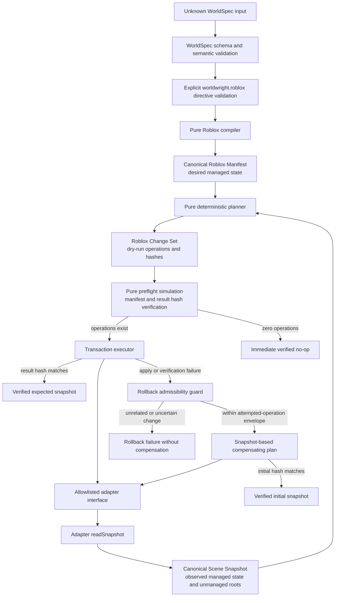
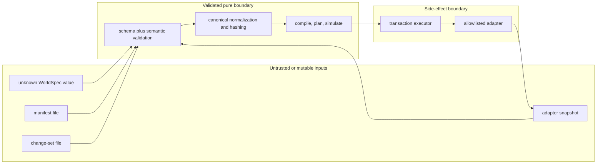
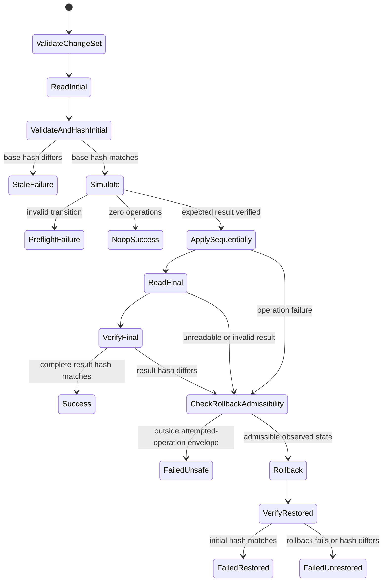

# Roblox compiler and transaction architecture

## Implemented boundary

Milestone 1 implements the offline boundary from a valid WorldSpec `0.1.0` document to a strict
Roblox Manifest, deterministic dry-run planning against a Roblox Scene Snapshot, pure change-set
simulation, and verified transactional execution through an abstract adapter.

The compiler package includes a deterministic in-memory adapter for tests and local simulation. It
does not itself connect to Studio, generate Luau, or expose a live `apply` command. Milestone 3 adds
a separate `@worldwright/studio-mcp-adapter` package that consumes this public adapter and
transaction boundary for one exact unsaved local Edit-mode sandbox. Forge, assets, published-place
mutation, and gameplay testing remain outside the compiler and adapter.

## Complete data flow

Compilation and planning do not read or modify adapter state. The transaction executor is the only
component in this flow that invokes adapter mutation methods, and it does so only after validating
and simulating the complete change set against a fresh base snapshot.

## Declarative contracts

The four generated draft 2020-12 JSON Schema artifacts are the language-neutral boundaries:

| Contract              | Role                                                | Schema ID                                 |
| --------------------- | --------------------------------------------------- | ----------------------------------------- |
| Roblox directive      | Explicit per-entity representation choice           | `urn:worldwright:roblox-directive:0.1.0`  |
| Roblox Manifest       | Complete desired managed state                      | `urn:worldwright:roblox-manifest:0.1.0`   |
| Roblox Scene Snapshot | Observed managed state and unmanaged-root markers   | `urn:worldwright:roblox-snapshot:0.1.0`   |
| Roblox Change Set     | Ordered dry-run transition with precondition hashes | `urn:worldwright:roblox-change-set:0.1.0` |

TypeBox source schemas in `packages/roblox-compiler/src/directive-schema.ts` and
`packages/roblox-compiler/src/contract-schema.ts` are authoritative. Generated files under
`packages/roblox-compiler/schema/` are checked for drift and are never hand-edited.

All domain objects are closed. Supported classes, properties, materials, managed attributes, and
operations are discriminated unions rather than arbitrary records. Each WorldSpec entity becomes one
node with the same ID, so identity is stable and reconciliation does not depend on array order or
`Instance.Name`.

## Trust boundaries

- Every public compile, plan, simulation, and apply entry point accepts or revalidates unknown
  boundary data and returns stable diagnostics for expected failures.
- A manifest file is not authority to mutate a scene; it must be reconciled with a validated
  snapshot to produce a change set.
- A change-set file is not authority to mutate arbitrary state; its project, target, and complete
  base snapshot hash must match a fresh adapter observation, and simulation must prove that its
  result reconstructs the manifest named by `desiredManifestHash`.
- Adapter output is treated as untrusted. Snapshots are validated both before mutation and after
  forward or compensating operations.
- Adapter methods expose only supported node operations. They do not expose arbitrary class
  creation, property setting, script creation, or an escape hatch to another service.
- Expected invalid input and adapter failures become structured results without stack traces.

## Deterministic normalization and hashing

The compiler contracts use code-point string ordering, never locale-sensitive comparison. Canonical
Roblox compiler JSON recursively orders every object key by Unicode code point, deterministically
sorts contract-defined collections, uses two-space indentation, and has exactly one final line feed.
Generated artifacts contain no timestamps, random UUIDs, machine paths, or platform-specific line
endings.

Hashes are lowercase hexadecimal SHA-256 values over canonical serialized data:

- the WorldSpec source hash is computed from `stringifyWorldSpec(validatedWorldSpec)`, not the
  caller's original representation;
- the manifest hash covers the complete normalized desired state;
- the complete snapshot hash covers managed nodes and unmanaged-root records;
- the change-set hash covers its complete normalized contract; and
- hashes are external preconditions rather than self-referential fields in the value being hashed.

The three change-set hashes protect distinct claims:

- `baseSnapshotHash` binds the transaction boundary before mutation. A newly observed unmanaged root
  changes it, so a stale plan cannot proceed on changed ownership evidence.
- `desiredManifestHash` binds the simulated managed result to a valid, non-empty desired manifest.
  It is an enforced provenance and integrity precondition, not descriptive metadata.
- `resultSnapshotHash` independently binds the complete expected result, including preserved
  unmanaged-root observations.

To verify `desiredManifestHash`, simulation derives a manifest from the validated result snapshot.
The fixed schema/compiler versions and supported WorldSpec version are used; project and target come
from the snapshot; `worldSpecHash` comes only from the root's `WorldwrightSourceHash`; root and
nodes come from managed state; and measurements are recomputed from node classes. Unmanaged roots
are observed ownership evidence and are excluded. The derived manifest must validate before its
canonical hash is compared. Consequently, a delete-all result, a missing or invalid root, or an
absent root source hash cannot pass as a forward manifest even if a caller recomputes
`resultSnapshotHash`.

## Identity and ownership

Managed identity is established by the WorldSpec entity ID and the closed attributes stored on each
manifest node:

- `WorldwrightManaged` is `true`;
- `WorldwrightProjectId` scopes the node to one project;
- `WorldwrightEntityId` equals the node ID;
- `WorldwrightEntityKind` records the semantic source kind;
- `WorldwrightCompilerVersion` records the producing compiler contract; and
- `WorldwrightSourceHash` appears only on the root.

Names are creator-facing display values, not identity. Arbitrary WorldSpec attributes, reference
URIs, prompts, notes, and private data are not copied into Roblox attributes.

A snapshot's `unmanagedRoots` list records direct user-owned child roots beneath managed parents.
The opaque snapshot ID is not a WorldSpec ID and does not grant Worldwright ownership. The marker
means that the affected parent lineage cannot be deleted or reparented. Property-only updates are
allowed when they neither destroy nor move that content. Worldwright does not inspect, clone,
serialize, quarantine, or modify unmanaged nodes in v0.1.

## Planning and dry-run semantics

Planning compares normalized node maps. It produces full-node operations in safe phases:

1. Create ancestors before descendants.
2. Update or reparent nodes after required parents exist.
3. Delete descendants before ancestors.

Equivalent-depth operations are ordered deterministically by node ID. Updates include complete
`before` and `after` nodes and are emitted only when those values differ. Deletes carry the complete
before node; creates carry the complete desired node. A class change is a conflict rather than an
implicit replacement.

The planner computes an exact expected result snapshot and exact create, update, delete, and total
counts. Planning an already converged snapshot produces a valid no-op change set. Repeating a plan
with the same normalized inputs is byte-identical.

Pure simulation revalidates the snapshot and change set, checks the base hash and each complete
before-state precondition, and uses the same deterministic ownership analysis as planning to reject
deleting or reparenting a protected lineage before generic graph validation can obscure the cause.
Its `simulation.unmanaged_descendant_conflict` points to the responsible operation and carries the
deterministically selected unmanaged-root witness as `relatedId`. Simulation then enforces parent
and acyclic hierarchy rules, applies operations to an independent value, preserves unmanaged roots,
derives and verifies the desired manifest hash, and independently verifies the expected complete
result hash. The transaction executor uses this same simulation as preflight.

## Transaction stages

The detailed stages are:

1. Validate the change set.
2. Read, validate, normalize, and hash the current adapter snapshot.
3. Compare the complete hash with the change-set base precondition. A stale failure performs zero
   mutations.
4. Simulate the complete transition, including desired-manifest and result-snapshot hash checks.
5. If the operation list is empty, return `noop` immediately with the verified preflight snapshot
   and hash. This path performs exactly one read, zero mutations, no second read, and no rollback.
6. Otherwise apply ordered operations sequentially through the adapter.
7. Read, validate, normalize, and hash final state.
8. Return `applied` success only when the final hash equals the expected result hash.

The result reports a stable failure stage and diagnostics, operations attempted, and hashes with
unambiguous meanings. `observedFailureSnapshotHash` is a valid state observed before compensation. A
successful rollback reports `restoredSnapshotHash`, which equals the initial hash. A failed rollback
may report `observedAfterRollbackSnapshotHash`, the latest valid observation after its attempt. The
restored hash is never substituted for the failure observation. Expected data, concurrency, adapter,
and verification failures are results rather than thrown success-path exceptions. Transaction
wrappers retain the cause diagnostic's path and `relatedId`, and include the underlying stable code
in their sanitized message.

## Snapshot-based rollback

If application or verification fails, the executor does not assume which mutations took effect. It
reads a fresh validated snapshot and first checks whether the observation is admissible for
compensation. The check considers only the prefix of forward operations whose adapter calls were
attempted:

- every managed node not targeted by that prefix must exactly equal its initial state, and an
  initially absent unrelated ID must remain absent;
- an attempted create target may be absent or exactly equal the normalized created node;
- an attempted update target may exactly equal its normalized `before` or `after` node;
- an attempted delete target may exactly equal its normalized `before` node or be absent;
- the complete normalized `unmanagedRoots` collection must exactly equal the initial collection; and
- root presence and identity may differ only when explained by an attempted root create or delete.

An unrelated addition, deletion, or property edit, changed unmanaged-root record, or third state at
an attempted target produces `transaction.rollback_unsafe_observed_state`. No compensating adapter
mutation is called, and the observed state is preserved. When the observation is admissible, the
executor plans from it to the exact initial snapshot, applies that compensation, reads again, and
compares the complete hash with the initial hash.

For an admissibility rejection, the valid hash is reported only as the pre-compensation failure
state. There is no post-rollback observation because the guard deliberately permits no intervening
mutation.

This handles an adapter operation that mutates and then throws, as long as its resulting state stays
inside the attempted-operation envelope. Rollback can also fail; that outcome is explicit and is
never reported as restored state. The transaction does not claim atomic engine behavior. It provides
a verified compensating protocol over an adapter and chooses failure over overwriting a change whose
cause is uncertain.

## Concurrency model

`baseSnapshotHash` protects the complete state boundary before mutation. Full `before` node checks
protect targeted operations as they execute. The rollback admissibility guard prevents compensation
from overwriting detected unrelated managed or unmanaged-root changes.

These checks do not provide engine-level atomicity or transaction isolation. Any live adapter must
serialize Worldwright transactions within one selected project scope and treat creator edits during
an asynchronous transaction as a concurrency hazard. The Milestone 3 Studio adapter preserves that
boundary for an exact unsaved sandbox. If causality cannot be established from the
attempted-operation envelope, Worldwright reports rollback failure and leaves the unrelated state
untouched.

## Adapter boundary

The compiler interface is intentionally narrow: read the selected project snapshot, create one
allowlisted node, update a complete node under a full before-state precondition, and delete a
complete before node. Every read and mutation is scoped to the project and the `Workspace` target.

The testing subpath exports the in-memory adapter and deterministic fault injection. That adapter
holds independent state, preserves unmanaged roots, enforces identity, parents, cycles, deletion
ordering, and ownership rules, and can model failures before a call, after mutation, incorrect
post-apply state, and rollback failure. It is a test double, not a production Studio adapter.

The separate `StudioMcpRobloxAdapter` implements the same four methods through fixed bridge actions.
It validates an exact Studio session, requires an unsaved stopped-Edit-mode sandbox, verifies actual
engine state, and maps direct unmanaged roots. It still delegates stale checks, pure simulation,
result verification, rollback admissibility, and compensation to this compiler executor. See
[Studio MCP adapter architecture](studio-mcp-adapter.md).

## Studio mapping and future Forge integration

The Milestone 3 Roblox Studio adapter implements the same interface by creating and updating the
allowlisted [Instance](https://create.roblox.com/docs/reference/engine/classes/Instance) and
[BasePart](https://create.roblox.com/docs/reference/engine/classes/BasePart) classes. For primitive
rotation it must construct the equivalent of
`CFrame.new(position) * CFrame.fromEulerAnglesXYZ(math.rad(x), math.rad(y), math.rad(z))`; parent
transforms remain organizational in contract v0.1.

A future use of
[ChangeHistoryService](https://create.roblox.com/docs/reference/engine/classes/ChangeHistoryService)
may complement creator undo, but it does not provide transaction isolation and cannot replace
project-scoped serialization, snapshot preconditions, post-apply verification, rollback
admissibility, or verified compensation in this protocol.

Forge remains the future creator-facing Studio interface. It may present manifests and dry-run
change sets, explain conflicts, request explicit approval, and call a separately implemented live
adapter. Forge does not exist in Milestone 1.

[Studio MCP](https://create.roblox.com/docs/studio/mcp) is the transport selected for the first live
adapter. Connectivity does not relax any contract, allowlist, ownership, hashing, or rollback rule.
The adapter exposes no raw Luau, supports no remote MCP transport, and refuses published or running
places.

The Architecture Planner is implemented in a separate offline package. Atlas, broader planners,
asset routing, live playtest observation, and The Critic remain future systems. The primitive
compiler consumes already-authored explicit directives; neither compiler nor adapter evaluates
gameplay or visual quality.
