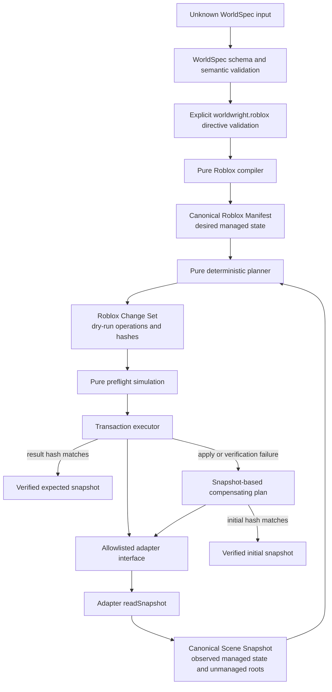
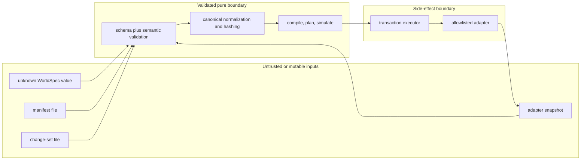
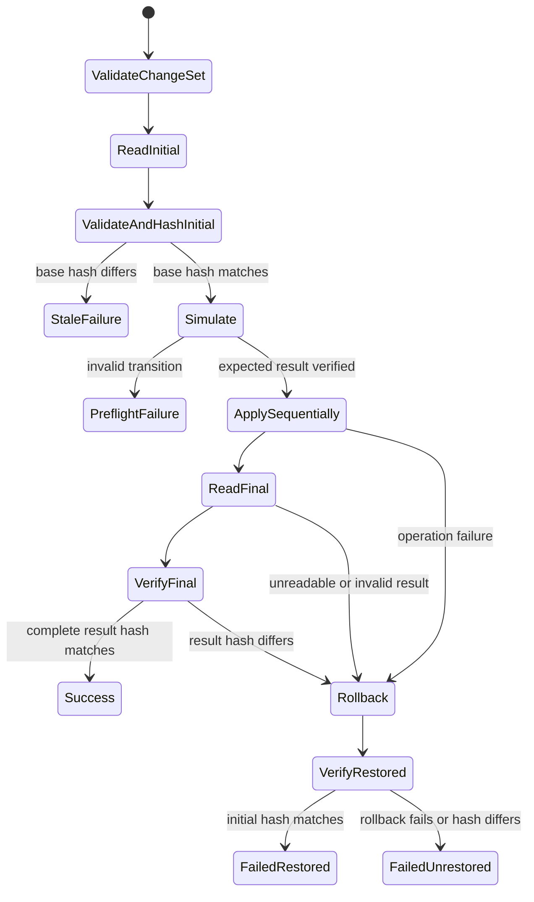

# Roblox compiler and transaction architecture

## Implemented boundary

Milestone 1 implements the offline boundary from a valid WorldSpec `0.1.0` document to a strict
Roblox Manifest, deterministic dry-run planning against a Roblox Scene Snapshot, pure change-set
simulation, and verified transactional execution through an abstract adapter.

The repository includes a deterministic in-memory adapter for tests and local simulation. It does
not include a Roblox Studio adapter, a Forge plugin, Studio MCP connectivity, live Instance
mutation, Luau generation, assets, or a command that applies changes to a place.

## Complete data flow

Compilation and planning do not read or modify adapter state. The transaction executor is the only
component in this flow that invokes adapter mutation methods, and it does so only after validating
and simulating the complete change set against a fresh base snapshot.

## Declarative contracts

The four generated draft 2020-12 JSON Schema artifacts are the language-neutral boundaries:

| Contract              | Role                                                | Schema ID                                 |
| --------------------- | --------------------------------------------------- | ----------------------------------------- |
| Roblox directive      | Explicit per-entity representation choice           | `urn:worldwright:roblox-directive:0.1.0`  |
| Roblox Manifest       | Complete desired managed state                      | `urn:worldwright:roblox-manifest:0.1.0`   |
| Roblox Scene Snapshot | Observed managed state and unmanaged-root markers   | `urn:worldwright:roblox-snapshot:0.1.0`   |
| Roblox Change Set     | Ordered dry-run transition with precondition hashes | `urn:worldwright:roblox-change-set:0.1.0` |

TypeBox source schemas in `packages/roblox-compiler/src/directive-schema.ts` and
`packages/roblox-compiler/src/contract-schema.ts` are authoritative. Generated files under
`packages/roblox-compiler/schema/` are checked for drift and are never hand-edited.

All domain objects are closed. Supported classes, properties, materials, managed attributes, and
operations are discriminated unions rather than arbitrary records. Each WorldSpec entity becomes one
node with the same ID, so identity is stable and reconciliation does not depend on array order or
`Instance.Name`.

## Trust boundaries

- Every public compile, plan, simulation, and apply entry point accepts or revalidates unknown
  boundary data and returns stable diagnostics for expected failures.
- A manifest file is not authority to mutate a scene; it must be reconciled with a validated
  snapshot to produce a change set.
- A change-set file is not authority to mutate arbitrary state; its project, target, and complete
  base snapshot hash must match a fresh adapter observation.
- Adapter output is treated as untrusted. Snapshots are validated both before mutation and after
  forward or compensating operations.
- Adapter methods expose only supported node operations. They do not expose arbitrary class
  creation, property setting, script creation, or an escape hatch to another service.
- Expected invalid input and adapter failures become structured results without stack traces.

## Deterministic normalization and hashing

The compiler contracts use code-point string ordering, never locale-sensitive comparison. Canonical
Roblox compiler JSON recursively orders every object key by Unicode code point, deterministically
sorts contract-defined collections, uses two-space indentation, and has exactly one final line feed.
Generated artifacts contain no timestamps, random UUIDs, machine paths, or platform-specific line
endings.

Hashes are lowercase hexadecimal SHA-256 values over canonical serialized data:

- the WorldSpec source hash is computed from `stringifyWorldSpec(validatedWorldSpec)`, not the
  caller's original representation;
- the manifest hash covers the complete normalized desired state;
- the complete snapshot hash covers managed nodes and unmanaged-root records;
- the change-set hash covers its complete normalized contract; and
- hashes are external preconditions rather than self-referential fields in the value being hashed.

The base snapshot hash is an optimistic concurrency guard. A newly observed unmanaged root changes
that hash, so a previously planned destructive operation cannot proceed on stale ownership evidence.

## Identity and ownership

Managed identity is established by the WorldSpec entity ID and the closed attributes stored on each
manifest node:

- `WorldwrightManaged` is `true`;
- `WorldwrightProjectId` scopes the node to one project;
- `WorldwrightEntityId` equals the node ID;
- `WorldwrightEntityKind` records the semantic source kind;
- `WorldwrightCompilerVersion` records the producing compiler contract; and
- `WorldwrightSourceHash` appears only on the root.

Names are creator-facing display values, not identity. Arbitrary WorldSpec attributes, reference
URIs, prompts, notes, and private data are not copied into Roblox attributes.

A snapshot's `unmanagedRoots` list records direct user-owned child roots beneath managed parents.
The opaque snapshot ID is not a WorldSpec ID and does not grant Worldwright ownership. The marker
means that the affected parent lineage cannot be deleted or reparented. Property-only updates are
allowed when they neither destroy nor move that content. Worldwright does not inspect, clone,
serialize, quarantine, or modify unmanaged nodes in v0.1.

## Planning and dry-run semantics

Planning compares normalized node maps. It produces full-node operations in safe phases:

1. Create ancestors before descendants.
2. Update or reparent nodes after required parents exist.
3. Delete descendants before ancestors.

Equivalent-depth operations are ordered deterministically by node ID. Updates include complete
`before` and `after` nodes and are emitted only when those values differ. Deletes carry the complete
before node; creates carry the complete desired node. A class change is a conflict rather than an
implicit replacement.

The planner computes an exact expected result snapshot and exact create, update, delete, and total
counts. Planning an already converged snapshot produces a valid no-op change set. Repeating a plan
with the same normalized inputs is byte-identical.

Pure simulation revalidates the snapshot and change set, checks the base hash and each complete
before-state precondition, enforces parent and acyclic hierarchy rules, applies operations to an
independent value, preserves unmanaged roots, and verifies the expected result hash. The transaction
executor uses the same simulation as preflight.

## Transaction stages

The detailed stages are:

1. Validate the change set.
2. Read, validate, normalize, and hash the current adapter snapshot.
3. Compare the complete hash with the change-set base precondition. A stale failure performs zero
   mutations.
4. Simulate the complete transition and verify its expected result.
5. Apply ordered operations sequentially through the adapter.
6. Read, validate, normalize, and hash final state.
7. Return `applied` or `noop` success only when the final hash equals the expected result hash.

The result reports a stable failure stage and diagnostics, operations attempted, initial hash, an
observed final hash when available, and rollback attempt and success status. Expected data,
concurrency, adapter, and verification failures are results rather than thrown success-path
exceptions.

## Snapshot-based rollback

If application or verification fails, the executor does not assume which mutations took effect. It
reads the currently observable state and plans a compensating transition from that state to the
exact initial snapshot. It applies that plan, reads again, and compares the complete snapshot hash
with the initial hash.

This handles an adapter operation that mutates and then throws, as long as its resulting state is
observable and still reconcilable. Rollback can also fail; that outcome is explicit and is never
reported as restored state. The transaction does not claim atomic engine behavior. It provides a
verified compensating protocol over an adapter.

## Adapter boundary

The current interface is intentionally narrow: read the selected project snapshot, create one
allowlisted node, update a complete node under a full before-state precondition, and delete a
complete before node. Every read and mutation is scoped to the project and the `Workspace` target.

The testing subpath exports the in-memory adapter and deterministic fault injection. That adapter
holds independent state, preserves unmanaged roots, enforces identity, parents, cycles, deletion
ordering, and ownership rules, and can model failures before a call, after mutation, incorrect
post-apply state, and rollback failure. It is a test double, not a production Studio adapter.

## Future Studio, Forge, and MCP integration

A future Roblox Studio adapter may implement the same interface by creating and updating the
allowlisted [Instance](https://create.roblox.com/docs/reference/engine/classes/Instance) and
[BasePart](https://create.roblox.com/docs/reference/engine/classes/BasePart) classes. For primitive
rotation it must construct the equivalent of
`CFrame.new(position) * CFrame.fromEulerAnglesXYZ(math.rad(x), math.rad(y), math.rad(z))`; parent
transforms remain organizational in contract v0.1.

That adapter is not implemented. A future use of
[ChangeHistoryService](https://create.roblox.com/docs/reference/engine/classes/ChangeHistoryService)
may complement creator undo, but it cannot replace snapshot preconditions, post-apply verification,
or verified compensation in this protocol.

Forge remains the future creator-facing Studio interface. It may present manifests and dry-run
change sets, explain conflicts, request explicit approval, and call a separately implemented live
adapter. Forge does not exist in Milestone 1.

[Studio MCP](https://create.roblox.com/docs/studio/mcp) remains a possible future transport for an
adapter. Connectivity does not relax any contract, allowlist, ownership, hashing, or rollback rule,
and no MCP client or server is present in this milestone.

Atlas, planners, asset routing, and The Critic are also future systems. The primitive compiler
consumes already-authored explicit directives; it does not infer architectural layout or evaluate a
live world.
