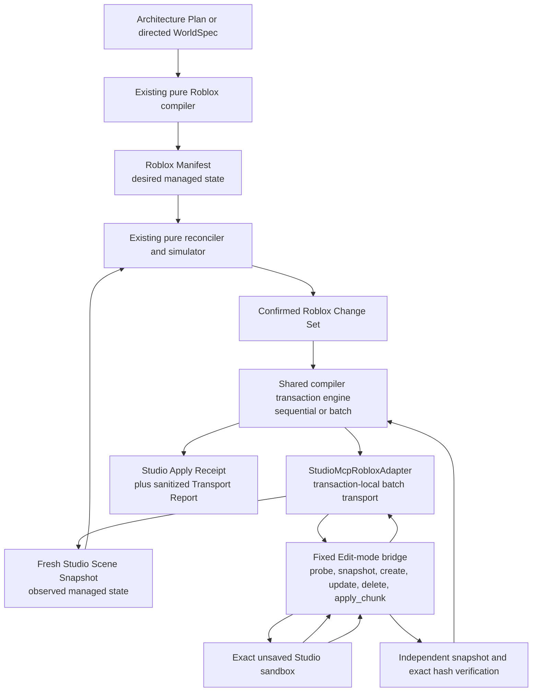

# Roblox Studio MCP adapter architecture

## Implemented boundary

Milestone 3 added `@worldwright/studio-mcp-adapter`, Worldwright's first deliberately bounded live
Roblox integration. Milestone 4 retains that boundary and adds deterministic fixed batch mutation,
client poisoning, exact-session reconnection, and observation-gated compensation. The package
connects to Roblox Studio's built-in MCP server over a locally started stdio process, observes one
exact Studio session, and implements the Roblox compiler's sequential and optional batch adapter
interfaces with fixed Edit-mode Luau bridge programs.

The package is not a general Studio automation client. It can inspect or mutate managed project
state only in an unsaved local sandbox where `game.PlaceId == 0`, `game.GameId == 0`, and the data
model is stopped in Edit mode. Every mutation names the exact Studio session. The public API exposes
no raw `execute_luau`, arbitrary MCP tool call, dynamic class or property setter, script creation,
asset operation, HTTP transport, or published-place bypass.

WorldSpec, the Architecture Plan, Roblox Manifest, Scene Snapshot, and Change Set remain their
existing contracts. The adapter does not replace them with a Studio-specific scene model.



## Process startup and lifecycle

The production client supports local stdio only. On Windows it expands `process.env.LOCALAPPDATA` in
Node and starts this executable chain through the MCP SDK's `StdioClientTransport`:

```text
cmd.exe
/d
/s
/c
call
<expanded LOCALAPPDATA>\Roblox\mcp.bat
```

The literal `%LOCALAPPDATA%` token is never delegated to child-process expansion, `shell: true` is
not used, and the public CLI cannot replace the command with an arbitrary executable. On macOS the
default executable is `/Applications/RobloxStudio.app/Contents/MacOS/StudioMCP`. Linux is rejected
as unsupported rather than guessing a path.

Startup, session registration discovery, every tool call, and shutdown have bounded timeouts. On
Windows, shutdown invokes the system `taskkill.exe` with the SDK-owned shell PID and `/T /F` before
SDK close, then verifies that PID exited. This terminates the synchronous `StudioMCP.exe` child
instead of allowing a privileged call to survive `cmd.exe`. The seven-second outer close bound
exceeds the SDK's internal shutdown stages. Studio can register open sessions asynchronously after
the stdio handshake, so session discovery retries empty or transiently partial lists for at most six
seconds. The client owns clean shutdown and process termination, does not inherit interactive stdin
or forward uncontrolled server stderr, and sanitizes startup failures. The rest of the package
depends on a narrow client abstraction rather than MCP SDK internals, limiting the impact of a later
SDK or protocol migration.

## Tool discovery and capability negotiation

After connection the client lists the server's tools and validates the discovered input schemas.
Core operation requires these exact names:

- `list_roblox_studios`
- `set_active_studio`
- `get_studio_state`
- `execute_luau`

The `execute_luau` schema must provide a Luau source or code string field, a `datamodel_type` field,
and the Edit data-model value. An absent requirement fails with `studio.tool_missing`; an
incompatible schema fails with `studio.tool_schema_unsupported`. Worldwright does not guess
arguments from a familiar tool name.

The client records `search_game_tree`, `inspect_instance`, and `screen_capture` when present. The
first two may provide independent diagnostic cross-checks, never the canonical snapshot.
`screen_capture` is optional for the package's transaction APIs but required for the full Milestone
3 live evidence run. Asset-generation, insertion, search, subagent, HTTP, and other unrelated Studio
tools are never invoked.

## Studio selection and the sandbox gate

The session boundary deliberately separates listing, exact selection, and probing:

1. list connected Studio sessions;
2. select one discovered session by its exact ID;
3. read Studio state and run the fixed Edit-mode `probe` action;
4. compare the selected session with the tool result;
5. enforce place and data-model gates before reading managed project content or mutating it.

Every mutating CLI command requires `--studio-id`. A mutation target is never inferred from focus,
display name, active status, list order, or there being only one candidate. Read-only snapshot or
planning flows may auto-select only when exactly one session exists; explicit selection remains
preferred. Ambiguity returns sanitized candidates and performs no mutation.

The exact ID remains local selection state. The live-smoke runner accepts it privately for initial
selection and every re-selection, but omits it from the pre-mutation review and shareable summary.
It must not appear in committed artifacts or pull-request evidence. Strict receipt `0.1.0` still
contains sanitized sandbox identity, so raw receipts are private, ignored local files rather than
shareable evidence.

The probe observes the place name, `PlaceId`, `GameId`, data-model mode, playtest state, and Edit
execution availability. Managed project snapshot and mutation APIs then require:

- `PlaceId == 0`;
- `GameId == 0`;
- the stopped Edit data model; and
- the exact selected Studio session throughout the operation.

A nonzero place or game ID is `studio.published_place_forbidden`. Play, Run, simulation, or
unavailable Edit execution is `studio.edit_mode_required`. Version `0.1.0` contains no bypass.

Before each Studio-state read, fixed bridge execution, or viewport capture, the adapter reselects
the stored exact session ID and verifies that Studio reports it active. Studio MCP exposes a shared
active session rather than an atomic per-call target, so another trusted MCP client can still race
after that confirmation. Version `0.1.0` minimizes this window, fails closed through independent
snapshots and compensation, and requires creators not to switch Studio targets or run competing
clients during a transaction.

Every non-probe fixed bridge program also checks `PlaceId`, `GameId`, and `RunService:IsRunning()`
inside Studio immediately before action dispatch. This closes the place-state gap between the host
probe and the managed-state read or mutation; a place published, loaded, or started in that interval
fails before the action touches project state.

## Trust boundaries

| Boundary           | Treated as untrusted                                                 | Validation and authority                                                                                  |
| ------------------ | -------------------------------------------------------------------- | --------------------------------------------------------------------------------------------------------- |
| Host process       | environment and installation availability                            | resolve only the documented local command; sanitize paths and stderr                                      |
| MCP server         | tool list, schemas, results, session list, tool errors               | validate required schemas and every bounded result; accept only text bridge or image capture forms needed |
| Studio session     | display name, focus, selected state, engine mode                     | require exact discovered ID and probe again; never authorize by name or activity                          |
| Place              | mutable engine state and cloud association                           | require unsaved IDs and stopped Edit mode for project reads and mutation                                  |
| Luau transport     | broad `execute_luau` capability                                      | generate only fixed bridge programs with validated JSON payloads                                          |
| Managed Instances  | public attributes, adapter metadata, actual properties and hierarchy | verify all three views before producing a snapshot or applying a targeted operation                       |
| Unmanaged content  | any non-project root beneath managed content                         | observe only the structural boundary; never mutate, serialize, or claim identity                          |
| Transaction inputs | manifest, snapshot, change set, confirmation                         | reuse compiler validation, canonical hashes, simulation, and exact confirmation                           |
| Evidence           | image bytes, session metadata, local paths                           | explicit local output only; receipt retains media type, hash, and byte length only                        |

Enabling Studio MCP grants a privileged local capability. It does not make arbitrary clients safe;
creators should connect only clients they trust.

## Fixed Luau bridge

The internal bridge supports exactly five discriminated actions: `probe`, `snapshot`, `create`,
`update`, and `delete`. A program contains one audited fixed implementation plus one
schema-validated JSON payload embedded with a deterministic long-bracket literal. The literal
encoder chooses the smallest delimiter depth whose closing delimiter does not occur in the JSON.
Quotes, backslashes, Unicode, newlines, supported control characters, `]]`, `]=]`, and longer
delimiter-shaped inputs remain data rather than syntax.

Dynamic payload values are decoded by `HttpService:JSONDecode` and are never concatenated as Luau
identifiers. Class creation and every property or attribute operation use explicit branches. The
bridge does not use `loadstring`, arbitrary `require`, network requests, data stores,
MarketplaceService, InsertService, dynamic evaluation, generic property loops, or executable Roblox
Instances.

Managed-parent mutations include a strict parent-state record containing the complete canonical
parent node, canonical state JSON, and its Node-computed lowercase SHA-256. The bridge compares the
resolved Instance with that exact transaction observation; merely matching mutable metadata to the
parent's current state is insufficient. Workspace-root mutations omit this record.

Every bridge result contains one exact `WORLDWRIGHT_STUDIO_BRIDGE_V1\n` prefix followed by one
strict JSON object and one final newline. The built-in MCP has been observed to impose a tool-text
ceiling of approximately 100,000 bytes, so the bridge enforces a conservative 96 KiB (98,304-byte)
cap on the complete framed result. This transport-specific cap is stricter than the client's general
16 MiB MCP-result validation bound.

Snapshot success uses a deterministic compact wire value instead of repeating complete object keys
and strings for every node. Sorted unique dictionaries hold ID tokens, entity kinds, source hashes,
numbers, materials, shapes, and unmanaged classes. The sorted name dictionary is maximally
front-coded by Unicode scalar value, and malformed surrogate sequences are rejected. Managed nodes
and unmanaged-root records are sorted deterministically and encoded as fixed-length numeric tuples
with zero-based dictionary indexes and explicit `-1` absence sentinels. Each node's stored-state
SHA-256 is encoded in node order as exactly 40 canonical Z85 characters.

Studio establishes trust before compact encoding. Before snapshot traversal, the fixed bridge runs
three SHA-256 known vectors and fails closed if its runtime implementation disagrees. It then
computes SHA-256 over the exact raw `WorldwrightStudioStateJson` bytes and compares it with
`WorldwrightStudioStateHash`, validates the decoded metadata, and verifies the actual Instance
hierarchy, attributes, class, name, and every allowlisted engine property. The host then strictly
checks front-coding, Z85, dictionary uniqueness and order, tuple arity, integer and index ranges,
class codes, property flags, sentinels, identifiers, node order, hierarchy, root rules, and
unmanaged-root order. It reconstructs canonical nodes and requires each Node-computed canonical-node
hash to equal the corresponding decoded stored hash. Public compiler snapshot normalization and
validation follow. Compact transport does not weaken or replace either contract.

The client rejects a missing or repeated prefix, malformed JSON, duplicate object keys, unknown
fields, version mismatch, oversized or ambiguous content, and trailing non-whitespace output. JSON
whitespace and runtime-specific valid JSON number or string escaping do not need byte equality with
Node serialization; the validated value is normalized in Node.

## Exact-state metadata and engine verification

The existing public attributes remain the ownership record:

- `WorldwrightManaged`
- `WorldwrightProjectId`
- `WorldwrightEntityId`
- `WorldwrightEntityKind`
- `WorldwrightCompilerVersion`
- `WorldwrightSourceHash` on the root

The adapter writes exactly three internal attributes:

- `WorldwrightStudioAdapterVersion`
- `WorldwrightStudioStateJson`
- `WorldwrightStudioStateHash`

The JSON is the canonical normalized managed node represented by the Instance. Its hash is computed
in Node before mutation. These values are bounded transport metadata and do not appear in compiler
Snapshot node attributes or Manifests.

Reading metadata is not enough. For every managed node, Studio computes SHA-256 over the exact raw
state-JSON bytes and requires it to match the stored state hash before decoding the value. The
bridge then verifies the decoded state shape, public ownership attributes, adapter version, ID and
project agreement, `ClassName`, `Name`, and the exact direct managed parent. For primitive classes
it also verifies `CFrame`, `Size`, `Anchored`, shape where applicable, `Material`, `Color`,
`Transparency`, `CanCollide`, `CanQuery`, `CanTouch`, and `CastShadow`.

Expected rotation follows compiler semantics:

```lua
CFrame.new(position)
    * CFrame.fromEulerAnglesXYZ(math.rad(x), math.rad(y), math.rad(z))
```

Finite engine-converted numbers, vectors, colors, and `CFrame` components use epsilon `0.00001`.
Identity, hierarchy, names, classes, booleans, and enums are exact. Disagreement returns
`studio.engine_state_drift`; invalid metadata returns `studio.adapter_metadata_invalid`, while a
per-node state value beyond its bound returns `studio.adapter_metadata_too_large`. The adapter does
not adopt or repair a manually changed Instance automatically.

## Snapshot extraction

`StudioMcpRobloxAdapter.readSnapshot` runs one fixed snapshot bridge, traverses `Workspace` once
with a bounded iterative `GetChildren` queue, and returns a value that the public compiler
`validateRobloxSnapshot` accepts. The structural scan is bounded to 65,536 Workspace Instances and
the requested project is bounded to 2,048 managed nodes.

The extraction algorithm:

1. walk at most the bounded number of Workspace Instances without allocating all descendants;
2. follow selected-project managed children only when building the exact managed project index,
   never crossing an unmanaged or foreign-project boundary;
3. stop when either the structural-scan or managed-node bound is exceeded;
4. compute SHA-256 over each exact raw state-JSON value and require the corresponding stored hash;
5. validate decoded metadata, supported classes, public attributes, hierarchy, and actual engine
   state before constructing response records;
6. build project and entity-ID maps and reject duplicates;
7. resolve exactly one selected-project root when the project is non-empty;
8. verify the root is a `Folder` or `Model`, is a direct child of `Workspace`, has no managed
   parent, and carries the selected project's source hash;
9. require every other selected-project node to have a direct selected-project managed parent;
10. reject nodes outside the root, cycles, and malformed hierarchy;
11. record direct unmanaged or foreign-project roots beneath selected managed nodes;
12. emit maximally front-coded names, node-order Z85 state hashes, sorted dictionaries, and compact
    tuples within the 96 KiB framed bridge-output cap;
13. strictly decode that transport on the host and reconstruct canonical managed nodes;
14. require every decoded stored-state hash to equal the Node-computed hash of its reconstructed
    canonical node;
15. convert only contract fields to the compiler Scene Snapshot;
16. normalize and validate the result again through `@worldwright/roblox-compiler`; and
17. return a deep-independent value.

No selected-project nodes is a valid empty snapshot with no root, nodes, or unmanaged roots.

## Unmanaged-root mapping

An unmanaged-root record identifies a direct child of a selected managed node that is not managed by
that project. The bridge returns a deterministic structural descriptor containing the direct managed
parent entity ID, child class and name, canonical structural path, and duplicate ordinal. The
ordinal counts only siblings with the same class and name, so inserting or reordering an unrelated
sibling does not change existing markers. The path is
`<parent-id>/<class>/<name>/<duplicate-ordinal>`. Node code canonicalizes and hashes that descriptor
to a bounded `unmanaged-<hex-fragment>` snapshot ID.

This is structural, observation-local identity, not a permanent Roblox object identifier. Ordinary
Edit-mode Luau cannot rely on `Instance.UniqueId`, and `GetDebugId` requires Plugin Security. A
rename, reparent, class change, path change, or duplicate-order change therefore changes the
complete snapshot hash. Worldwright never writes the derived ID back to the unmanaged Instance.

## Create flow

`createNode` validates a complete compiler node, verifies project and parent identity, and confirms
the entity ID is absent. A managed parent must still match the complete parent node, state JSON,
state hash, and engine properties captured by the transaction snapshot. The bridge uses an explicit
class switch for `Folder`, `Model`, `Part`, `WedgePart`, or `CornerWedgePart`, creates the Instance
detached from `Workspace`, applies every allowlisted property and public ownership attribute
explicitly, applies canonical adapter metadata, and parents it only after initialization. It then
rereads and verifies the exact state.

The adapter, without changing the compiler node schema, rejects managed request names above Roblox's
100-Unicode-scalar `Instance.Name` limit. Fixed Luau repeats the scalar/code-point check before any
mutation, and compact snapshot decoding applies the same limit to managed and unmanaged names.

A failure before parenting destroys the detached Instance. A failure after parenting may remove only
the just-created matching managed node, only when it has no child and exact ownership, ID, and class
still match. Cleanup is protected, rereads the project index, and reports `studio.create_failed`
only after absence is verified. Any cleanup exception or uncertain remainder reports the distinct
`studio.create_cleanup_failed`. Display name is never deletion authority.

## Update flow and operation-local restoration

`updateNode` requires matching before/after IDs, classes, and project identity. It locates the
target by project and entity ID, verifies actual state against the complete `before` node, checks
ownership for reparenting, verifies the destination parent against its transaction-observed state,
captures the before state and metadata, applies allowlisted fields explicitly in a protected call,
updates metadata last, and verifies the complete `after` state.

If application or verification fails, that same fixed bridge call attempts to restore and verify the
complete before state, but first requires the original parent to match the exact state observed by
the transaction. The result distinguishes operation-local restoration success from failure. It never
reports an update as successful after a partial write. This restoration reduces partial state but
does not replace the outer transaction's fresh observation, admissibility check, or verified
compensation.

## Delete flow

`deleteNode` locates the exact project/entity target and verifies the complete `before` node. It
requires no remaining selected-project managed children, no unmanaged child or descendant root, and
no foreign-project root in the subtree. Only that verified Instance is destroyed, and its entity ID
must then be absent.

The reconciler already orders descendants before ancestors. The bridge repeats leaf and ownership
checks so malformed or stale callers cannot turn deletion into arbitrary recursive destruction.

## Transaction integration and compensation

The Studio adapter implements the compiler's existing `readSnapshot`, `createNode`, `updateNode`,
and `deleteNode` methods plus its optional generic batch method. The Studio CLI uses the shared
compiler transaction engine through `applyRobloxChangeSetBatched`; it does not copy transaction
logic into MCP code. The original sequential `applyRobloxChangeSet` surface remains compatible.

Before the first mutation, the executor reads a complete snapshot, validates it, compares its hash
with `baseSnapshotHash`, and purely simulates the transition. A stale or invalid change set calls no
adapter mutation method. A zero-operation transaction returns `noop` after that single preflight
read.

Inside the authorized transaction context, the adapter caches the managed nodes from each snapshot
read. Successful create, update, and delete calls advance that expected map so later hierarchy
operations use the state established by earlier operations. Any executor snapshot read, including a
compensation observation, replaces the cache with the newly verified complete observation. This adds
operation-local parent preconditions without changing the compiler adapter or wire contracts.

After exact ordered sequential operations or deterministic chunks, a separate snapshot must equal
`resultSnapshotHash`, and simulation must establish the relationship to `desiredManifestHash`. On
apply or verification failure, the shared executor reads observed state and accepts only the exact
base, an exact canonical operation prefix, or the complete result. It compensates only a nonzero
prefix inside the attempted envelope. Compensation is successful only when a complete final snapshot
equals the exact initial hash. Creator edits can make rollback inadmissible; Worldwright then
preserves the uncertain state and reports failure instead of overwriting it.

An uncertain mutation response poisons and closes the current MCP client. The next observation may
use a new default local-stdio process only after exact original Studio-ID selection and a renewed
unsaved stopped-sandbox probe. The uncertain chunk is never retried, and version `0.1.0` never
automatically resumes forward work. See
[Studio transaction batching and reconnectable recovery](studio-transaction-batching.md) for the
current transport design.

No ChangeHistoryService API participates in this protocol, and Studio undo is not transaction
isolation.

## Receipts and viewport evidence

A strict Studio Apply Receipt records `applied`, `noop`, or `failed` status, adapter and schema
versions, sanitized sandbox identity, project and target, all transition hashes, planned and
attempted counts, transaction stage and diagnostics when failed, rollback outcome and observed
hashes where applicable, and optional viewport evidence metadata.

Receipts contain no timestamp, local path, raw image, full snapshot or change set, raw MCP output,
Studio log, username, environment value, or credential. Their normalized hashes are deterministic. A
receipt records an observed result; it is not authorization, a digital signature, or evidence of
visual quality.

Receipt `0.1.0` includes sanitized sandbox identity and therefore remains private local evidence.
The live-smoke pre-mutation review and `summary.json` omit the exact Studio ID; only those sanitized
outputs may be copied into a review after the usual check for other private local details. Raw
receipts and probe output must not be committed or pasted into a pull request.

When `screen_capture` is available, capture requires an explicit output path beneath the
repository-owned ignored live-evidence directory and accepts only a structurally validated bounded
8-bit baseline-sequential JPEG with exact lowercase `image/jpeg`. Receipt outputs share the anchored
path check; lexical and real-parent checks reject junction escapes. The CLI reserves the output
before connection, writes decoded bytes once, and returns only media type, lowercase SHA-256, and
byte length for the receipt. Live evidence remains untracked. The complete live runner reserves its
receipts, summary, and JPEG before connecting and removes them all after any incomplete run.

## Failure modes

Failures are structured, bounded, and sanitized. The main categories are:

- process startup, handshake, timeout, or incompatible/missing tool;
- invalid, ambiguous, mixed, malformed, or oversized MCP output;
- unknown or ambiguous Studio session;
- published/cloud place or non-Edit data model;
- project, root, hierarchy, class, property, or managed-identity mismatch;
- missing adapter metadata or actual engine drift;
- managed-node or change-operation limit exceeded;
- unmanaged or foreign-project ownership conflict;
- create, create-cleanup uncertainty, update, operation-local restore, delete, snapshot, or
  transaction failure;
- unavailable or invalid viewport capture; and
- invalid receipt.

Diagnostics expose stable codes, severity, path, concise message, and only bounded identifiers such
as a related entity or tool name. Raw Luau source, stack traces, MCP messages, server stderr,
installation paths, and environment dumps remain outside the result boundary.

## Performance bounds

The adapter has explicit ceilings:

| Resource                           |   Limit |
| ---------------------------------- | ------: |
| Change-set operations              |     512 |
| Operations per batch               |      32 |
| Canonical batch request            |   3 MiB |
| Reconnects per transaction         |       2 |
| Managed nodes                      |   2,048 |
| Workspace structural scan          |  65,536 |
| Encoded state for one node         | 256 KiB |
| Encoded bridge payload             |   4 MiB |
| Complete framed bridge output      |  96 KiB |
| General MCP tool result validation |  16 MiB |
| Decoded JPEG file bytes            |  16 MiB |
| Declared JPEG pixel samples        | 256 MiB |
| MCP content items                  |       8 |
| Receipt diagnostics                |   4,099 |
| Process startup                    |    15 s |
| Session discovery                  |     6 s |
| Tool call                          |    30 s |
| Batch tool call                    |    45 s |
| Process close                      |     7 s |
| Engine numeric epsilon             | 0.00001 |

The snapshot bridge traverses `Workspace` once with an explicit bounded queue, builds maps in linear
time, and sorts dictionaries, nodes, and unmanaged roots for deterministic compact serialization.
Its 96 KiB framed-output limit stays below the built-in MCP's observed approximately 100,000-byte
tool-text ceiling. Mutation bridges locate the selected project root and index only its exact,
bounded, selected-project managed hierarchy once per call; they do not repeatedly traverse all of
`Workspace` or cross an unmanaged boundary. Traversal is iterative rather than dependent on
unbounded hierarchy depth.

The original single-action protocol intentionally uses one MCP `execute_luau` call per mutation.
Adapter package `0.2.0` adds a separate fixed `apply_chunk` protocol that applies at most 32 exact
ordered node operations per mutation call while retaining complete preconditions, attempted-prefix
evidence, ownership protection, and independent final verification.

## Future boundaries

- A future separately reviewed protocol may resume from an exact prefix; batch protocol `0.1.0`
  always restores after uncertain forward progress.
- A Forge plugin may add creator-native review and ChangeHistoryService recording around the safe
  transaction protocol; it cannot replace snapshot verification.
- A playtest observer may later enter a running data model and collect traversal, interaction, and
  performance evidence under a distinct authorization and observation contract.
- The Critic may later evaluate structured observations and request localized repair. A viewport
  capture in this milestone is not critique.
- Atlas, reference understanding, asset routing or generation, broader place authorization, and
  production deployment remain future work.

See [ADR 0004](../adr/0004-use-studio-mcp-for-the-first-live-adapter.md),
[ADR 0005](../adr/0005-chunk-studio-mutations-and-recover-by-observation.md), the
[Studio MCP Adapter 0.1 reference](../studio-mcp-adapter/0.1.0.md), the
[Studio MCP Adapter 0.2 reference](../studio-mcp-adapter/0.2.0.md), and the
[recovery runbook](../studio-mcp-adapter/recovery.md).
