# System overview

## Status and boundary

Worldwright is designed as a closed-loop world compiler. Two bounded foundations are implemented:

- **Milestone 0:** WorldSpec `0.1.0`, its validation and canonicalization library, CLI, fixtures,
  and generated schema.
- **Milestone 1:** an offline transactional Roblox primitive compiler that produces desired
  manifests, observes abstract scene snapshots, plans and simulates dry-run change sets, and
  verifies forward or compensating adapter transactions.

Milestone 1 includes only an in-memory test adapter. No live Roblox Studio adapter, Forge plugin,
Studio MCP transport, or actual Roblox world mutation is implemented.

```mermaid
flowchart LR
    Inputs["Inputs<br/>text, images, plans, sketches,<br/>heightmaps, existing places"]
    Atlas["Atlas<br/>reasoning and orchestration"]

    subgraph Current["Implemented foundations"]
        WorldSpec["WorldSpec v0.1<br/>schema, semantic validation,<br/>normalization, CLI"]
        RobloxCompiler["Transactional Roblox primitive compiler v0.1<br/>manifest, snapshot, dry-run plan,<br/>simulation, adapter protocol"]
    end

    Planners["Planners and<br/>constraint solver"]
    Router["Asset router"]
    LiveAdapter["Future Studio adapter<br/>Forge or Studio MCP transport"]
    World["Roblox world<br/>editable native content"]
    Critic["The Critic<br/>visual, architectural, gameplay,<br/>and performance evaluation"]
    Repair["Localized repair<br/>respecting locks and intent"]

    Inputs --> Atlas
    Atlas --> WorldSpec
    WorldSpec --> Planners
    Planners --> Router
    Router --> RobloxCompiler
    WorldSpec -->|"explicit primitive directives today"| RobloxCompiler
    RobloxCompiler --> LiveAdapter
    LiveAdapter --> World
    World --> Critic
    Critic --> Repair
    Repair --> Atlas

    classDef current fill:#d9f5e5,stroke:#176b3a,stroke-width:2px,color:#102a1c;
    classDef future fill:#f4f4f5,stroke:#71717a,stroke-dasharray:5 4,color:#27272a;
    class WorldSpec,RobloxCompiler current;
    class Inputs,Atlas,Planners,Router,LiveAdapter,World,Critic,Repair future;
```

Dashed gray components are future work. Arrows crossing from the offline compiler to a live adapter
describe intended contract flow, not an executable integration in this repository.

## Component responsibilities

| Component                      | Responsibility                                                                                                                                         | Current status                                                                                              |
| ------------------------------ | ------------------------------------------------------------------------------------------------------------------------------------------------------ | ----------------------------------------------------------------------------------------------------------- |
| Inputs                         | Human intent and reference media or places.                                                                                                            | Input kinds can be described in WorldSpec; no input-understanding pipeline exists.                          |
| Atlas                          | Understand intent, orchestrate planners and workers, and manage iteration.                                                                             | Future.                                                                                                     |
| WorldSpec                      | Carry versioned semantic intent, hierarchy, provenance, relationships, constraints, locks, and budgets.                                                | v0.1 schema, validation, normalization, serialization, CLI, fixtures, and tests implemented in Milestone 0. |
| Planners and constraint solver | Turn semantic requirements into coherent spatial and architectural plans and resolve constraints.                                                      | Future.                                                                                                     |
| Asset router                   | Select an appropriate source or generator for required assets.                                                                                         | Future.                                                                                                     |
| Roblox primitive compiler      | Compile explicitly directed WorldSpec entities into a desired managed-node manifest.                                                                   | Pure bounded compiler implemented in Milestone 1. It does not infer plans or mutate Studio.                 |
| Reconciler and simulator       | Compare a desired manifest with an observed snapshot, produce a deterministic dry-run change set, and compute its expected result.                     | Implemented in Milestone 1.                                                                                 |
| Transaction executor           | Apply an already validated plan through a narrow adapter, verify observed result state, and compensate to the verified initial snapshot after failure. | Protocol and in-memory tests implemented in Milestone 1. No live adapter exists.                            |
| Forge or Studio MCP adapter    | Translate the allowlisted adapter protocol to live Studio operations.                                                                                  | Future; no connectivity or live side effects in Milestone 1.                                                |
| Roblox world                   | The actual place to observe, traverse, edit, and test.                                                                                                 | No place is generated or modified by the current repository.                                                |
| The Critic                     | Evaluate observed results for visual, architectural, gameplay, traversal, and performance issues.                                                      | Future.                                                                                                     |
| Localized repair               | Propose and apply bounded corrections while honoring locks and preserved work.                                                                         | Future.                                                                                                     |

## Why WorldSpec remains the canonical semantic boundary

WorldSpec prevents the architecture from becoming a chain of disconnected prompts and
provider-specific objects. Each component can accept or emit a documented JSON contract, validate it
at its boundary, and report structured diagnostics. The contract is independent of TypeScript at the
wire level so future Python services and Luau-facing integrations can participate without sharing
process memory or TypeScript types.

WorldSpec validation has two layers:

1. **JSON Schema validation** checks document shape, required fields, closed objects, enumerations,
   and local numeric or string constraints.
2. **Semantic validation** checks graph-wide facts such as global ID uniqueness, valid hierarchy,
   acyclic parentage, reference integrity, relationship endpoints, constraint targets, and lock
   targets.

Milestone 1 does not change the WorldSpec `0.1.0` wire contract. Roblox representation choices live
inside the existing open entity `attributes` map under the strict `worldwright.roblox` directive.

## Implemented package boundaries

`@worldwright/worldspec` owns the semantic contract and exposes an intentionally small API for
schema constants and types, validation of unknown values, stable diagnostics, deterministic
normalization, and deterministic serialization.

`@worldwright/roblox-compiler` consumes that public API and owns four separate `0.1.0` contracts:

- entity compilation directives;
- Roblox Manifests as desired managed state;
- Roblox Scene Snapshots as observed managed state plus unmanaged-root protection; and
- Roblox Change Sets as ordered dry-run transitions with exact hash preconditions.

Compilation, planning, hashing, and simulation are pure. Transaction execution is isolated behind an
allowlisted asynchronous adapter. The currently implemented adapter is an in-memory testing utility
with deterministic fault injection; it is not a Studio integration.

See [Roblox compiler and transaction architecture](roblox-compiler.md) for data flow, trust
boundaries, ownership, hashing, transaction stages, and rollback.

## Current offline flow

1. Validate an unknown WorldSpec value and every explicit `worldwright.roblox` directive.
2. Compile one allowlisted managed node per WorldSpec entity into a canonical desired manifest.
3. Validate and normalize an observed scene snapshot for the same project and `Workspace` target.
4. Plan deterministic create, update, and delete operations while protecting unmanaged descendants.
5. Purely simulate the change set and calculate the exact expected result snapshot.
6. Through an abstract adapter, reject stale state before mutation, apply operations sequentially,
   and verify the complete resulting snapshot hash.
7. If apply or verification fails, observe partial state, plan compensation to the exact initial
   snapshot, and report rollback success only after its complete hash is restored.

The CLI exposes steps 1 through 5 as offline `compile` and `plan` commands. It exposes no live
`apply` command.

## Intended future closed loop

1. Inputs are understood by Atlas with evidence captured as WorldSpec references and provenance.
2. Atlas and planners elaborate WorldSpec entities, relationships, constraints, and budgets.
3. The asset router provides explicitly supported Roblox-native representations where primitives are
   insufficient.
4. A creator reviews a manifest and dry-run change set in Forge.
5. A separately authorized Studio adapter observes a project-scoped snapshot and performs the
   existing verified transaction protocol.
6. The resulting world is observed and tested in Roblox Studio.
7. The Critic emits localized findings tied back to semantic IDs.
8. Repair updates the bounded WorldSpec region or compilation result while respecting locks, then
   the loop runs again.

This flow remains deliberately staged. A later milestone must define and test the live adapter,
approval model, connection behavior, engine mapping, and operational recovery before any current
offline contract may cause a Studio side effect.
