# System overview

## Status and boundary

Worldwright is designed as a closed-loop world compiler. **Only the WorldSpec v0.1 foundation shown
in the solid current-foundation box is implemented in Milestone 0.** Every other system in the
end-to-end flow is architectural direction for later milestones.

```mermaid
flowchart LR
    Inputs["Inputs<br/>text, images, plans, sketches,<br/>heightmaps, existing places"]
    Atlas["Atlas<br/>reasoning and orchestration"]

    subgraph Current["Implemented in Milestone 0"]
        WorldSpec["WorldSpec v0.1<br/>schema, semantic validation,<br/>normalization, CLI"]
    end

    Planners["Planners and<br/>constraint solver"]
    Router["Asset router"]
    Compiler["Roblox compiler"]
    World["Roblox world<br/>editable native content"]
    Critic["The Critic<br/>visual, architectural, gameplay,<br/>and performance evaluation"]
    Repair["Localized repair<br/>respecting locks and intent"]

    Inputs --> Atlas
    Atlas --> WorldSpec
    WorldSpec --> Planners
    Planners --> Router
    Router --> Compiler
    Compiler --> World
    World --> Critic
    Critic --> Repair
    Repair --> Atlas

    classDef current fill:#d9f5e5,stroke:#176b3a,stroke-width:2px,color:#102a1c;
    classDef future fill:#f4f4f5,stroke:#71717a,stroke-dasharray:5 4,color:#27272a;
    class WorldSpec current;
    class Inputs,Atlas,Planners,Router,Compiler,World,Critic,Repair future;
```

Dashed gray components are future work. The arrows describe intended contract flow, not currently
executable integration.

## Component responsibilities

| Component                      | Responsibility                                                                                          | Milestone 0 status                                                                           |
| ------------------------------ | ------------------------------------------------------------------------------------------------------- | -------------------------------------------------------------------------------------------- |
| Inputs                         | Human intent and reference media or places.                                                             | Input kinds can be described in WorldSpec; no input-understanding pipeline exists.           |
| Atlas                          | Understand intent, orchestrate planners and workers, manage iteration.                                  | Future.                                                                                      |
| WorldSpec                      | Carry versioned semantic intent, hierarchy, provenance, relationships, constraints, locks, and budgets. | v0.1 schema, validation, normalization, serialization, CLI, fixtures, and tests implemented. |
| Planners and constraint solver | Turn semantic requirements into coherent spatial and architectural plans and resolve constraints.       | Future.                                                                                      |
| Asset router                   | Select an appropriate source or generator for each required asset.                                      | Future.                                                                                      |
| Roblox compiler                | Convert supported WorldSpec plans into transactional, editable Roblox-native content.                   | Future.                                                                                      |
| Roblox world                   | The actual place to observe, traverse, edit, and test.                                                  | No world generation or Roblox integration in Milestone 0.                                    |
| The Critic                     | Evaluate the observed result for visual, architectural, gameplay, traversal, and performance issues.    | Future.                                                                                      |
| Localized repair               | Propose and apply bounded corrections while honoring locks and preserved work.                          | Future.                                                                                      |

## Why WorldSpec is the first boundary

WorldSpec prevents the architecture from becoming a chain of disconnected prompts and
provider-specific objects. Each component can accept or emit a documented JSON contract, validate it
at its boundary, and report structured diagnostics. The contract is independent of TypeScript at the
wire level so that future Python services and Luau/Roblox integrations can participate without
sharing process memory or TypeScript types.

WorldSpec has two validity layers:

1. **JSON Schema validation** checks document shape, required fields, closed objects, enumerations,
   and local numeric or string constraints.
2. **Semantic validation** checks graph-wide facts such as global ID uniqueness, valid hierarchy,
   acyclic parentage, reference integrity, relationship endpoints, constraint targets, and lock
   targets.

The separation keeps the schema portable while allowing the package to express invariants that JSON
Schema cannot state clearly or maintainably.

## Milestone 0 package boundary

`@worldwright/worldspec` owns the v0.1 contract and exposes an intentionally small API for:

- schema constants and the runtime schema;
- schema-derived static types;
- parsing and validation of `unknown` values;
- stable structured diagnostics;
- deterministic, non-mutating normalization; and
- deterministic serialization.

The CLI is a thin file-system boundary over that API. The checked-in JSON Schema is
deterministically generated from the TypeBox source and verified for drift. Neither the library nor
CLI performs network requests.

## Intended future data flow

1. Inputs are understood by Atlas with evidence captured as WorldSpec references and provenance.
2. Atlas and planners elaborate WorldSpec entities, relationships, constraints, and budgets.
3. The asset router and Roblox compiler consume supported plan elements and produce native content
   transactionally.
4. The resulting world is observed and tested in Roblox Studio.
5. The Critic emits localized findings tied back to semantic IDs.
6. Repair updates the bounded WorldSpec region or compilation result while respecting locks, after
   which the loop runs again.

This flow is deliberately staged. A future milestone must define every executable boundary, failure
mode, and transaction model before adding the corresponding production component.
