# System overview

## Status and boundary

Worldwright is designed as a closed-loop world compiler. Three bounded offline foundations are
complete, and Milestone 3 adds the first live side-effect boundary:

- **Milestone 0:** WorldSpec `0.1.0`, its validation and canonicalization library, CLI, fixtures,
  and generated schema.
- **Milestone 1:** an offline transactional Roblox primitive compiler that produces desired
  manifests, observes abstract scene snapshots, plans and simulates dry-run change sets, and
  verifies forward or compensating adapter transactions.
- **Milestone 2:** a deterministic orthogonal Architecture Planner that turns one supported semantic
  building program into a reviewable Architecture Plan and a compiler-ready blockout WorldSpec.
- **Milestone 3:** a local-stdio Roblox Studio MCP adapter that can observe and transactionally
  reconcile managed content in one exact unsaved local Edit-mode sandbox.

The live boundary is intentionally smaller than the product vision. It adds no Forge plugin,
ChangeHistoryService call, AI provider, asset operation, published-place mutation, Play-mode test,
visual critique, or autonomous repair. Its public API cannot execute arbitrary Luau.

```mermaid
flowchart LR
    Inputs["Inputs<br/>text, images, plans, sketches,<br/>heightmaps, existing places"]
    Atlas["Atlas<br/>reasoning and orchestration"]

    subgraph Current["Implemented foundations"]
        WorldSpec["WorldSpec v0.1<br/>schema, semantic validation,<br/>normalization, CLI"]
        ArchitecturePlanner["Architecture Planner v0.1<br/>bounded integer-grid search,<br/>reviewable plan and blockout emission"]
        RobloxCompiler["Transactional Roblox primitive compiler v0.1<br/>manifest, snapshot, dry-run plan,<br/>simulation, adapter protocol"]
        StudioAdapter["Studio MCP Adapter v0.1<br/>exact unsaved sandbox,<br/>fixed bridge and live verification"]
    end

    FuturePlanners["Future topology, learned,<br/>and reference-aware planners"]
    Router["Asset router"]
    World["Roblox world<br/>editable native content"]
    Critic["The Critic<br/>visual, architectural, gameplay,<br/>and performance evaluation"]
    Repair["Localized repair<br/>respecting locks and intent"]

    Inputs --> Atlas
    Atlas --> WorldSpec
    WorldSpec --> ArchitecturePlanner
    ArchitecturePlanner --> RobloxCompiler
    WorldSpec --> FuturePlanners
    FuturePlanners --> Router
    Router --> RobloxCompiler
    WorldSpec -->|"explicit primitive directives today"| RobloxCompiler
    RobloxCompiler --> StudioAdapter
    StudioAdapter --> World
    World --> Critic
    Critic --> Repair
    Repair --> Atlas

    classDef current fill:#d9f5e5,stroke:#176b3a,stroke-width:2px,color:#102a1c;
    classDef future fill:#f4f4f5,stroke:#71717a,stroke-dasharray:5 4,color:#27272a;
    class WorldSpec,ArchitecturePlanner,RobloxCompiler,StudioAdapter current;
    class Inputs,Atlas,FuturePlanners,Router,World,Critic,Repair future;
```

Dashed gray components are future work. The arrow from the compiler through the Studio adapter is
implemented only for existing managed contracts in an exact unsaved local Edit-mode sandbox. The
Roblox world remains gray because published worlds, running gameplay, and production deployment are
not implemented.

## Component responsibilities

| Component                 | Responsibility                                                                                                                                         | Current status                                                                                              |
| ------------------------- | ------------------------------------------------------------------------------------------------------------------------------------------------------ | ----------------------------------------------------------------------------------------------------------- |
| Inputs                    | Human intent and reference media or places.                                                                                                            | Input kinds can be described in WorldSpec; no input-understanding pipeline exists.                          |
| Atlas                     | Understand intent, orchestrate planners and workers, and manage iteration.                                                                             | Future.                                                                                                     |
| WorldSpec                 | Carry versioned semantic intent, hierarchy, provenance, relationships, constraints, locks, and budgets.                                                | v0.1 schema, validation, normalization, serialization, CLI, fixtures, and tests implemented in Milestone 0. |
| Architecture Planner      | Turn the supported one-building orthogonal program into a strict plan and compiler-ready primitive blockout.                                           | Bounded deterministic `double_loaded_spine` planner implemented in Milestone 2.                             |
| Broader planners          | Add other topologies, reference-image constraints, learned proposals, and localized repair.                                                            | Future.                                                                                                     |
| Asset router              | Select an appropriate source or generator for required assets.                                                                                         | Future.                                                                                                     |
| Roblox primitive compiler | Compile explicitly directed WorldSpec entities into a desired managed-node manifest.                                                                   | Pure bounded compiler implemented in Milestone 1. It does not infer plans or mutate Studio.                 |
| Reconciler and simulator  | Compare a desired manifest with an observed snapshot, produce a deterministic dry-run change set, and compute its expected result.                     | Implemented in Milestone 1.                                                                                 |
| Transaction executor      | Apply an already validated plan through a narrow adapter, verify observed result state, and compensate to the verified initial snapshot after failure. | Implemented in Milestone 1 and reused unchanged by the live adapter.                                        |
| Studio MCP adapter        | Select an exact sandbox, verify engine state, and translate the allowlisted adapter protocol to fixed Studio operations.                               | Local stdio, unsaved-only, stopped-Edit-mode boundary implemented in Milestone 3.                           |
| Forge                     | Present creator-native review, approval, locks, and local regeneration in Studio.                                                                      | Future; the MCP adapter is not a plugin or creator UI.                                                      |
| Roblox world              | The actual place to observe, traverse, edit, and test.                                                                                                 | Managed content may be observed and changed only in an unsaved local sandbox; gameplay testing is future.   |
| The Critic                | Evaluate observed results for visual, architectural, gameplay, traversal, and performance issues.                                                      | Future.                                                                                                     |
| Localized repair          | Propose and apply bounded corrections while honoring locks and preserved work.                                                                         | Future.                                                                                                     |

## Why WorldSpec remains the canonical semantic boundary

WorldSpec prevents the architecture from becoming a chain of disconnected prompts and
provider-specific objects. Each component can accept or emit a documented JSON contract, validate it
at its boundary, and report structured diagnostics. The contract is independent of TypeScript at the
wire level so future Python services and Luau-facing integrations can participate without sharing
process memory or TypeScript types.

WorldSpec validation has two layers:

1. **JSON Schema validation** checks document shape, required fields, closed objects, enumerations,
   and local numeric or string constraints.
2. **Semantic validation** checks graph-wide facts such as global ID uniqueness, valid hierarchy,
   acyclic parentage, reference integrity, relationship endpoints, constraint targets, and lock
   targets.

Milestone 1 does not change the WorldSpec `0.1.0` wire contract. Roblox representation choices live
inside the existing open entity `attributes` map under the strict `worldwright.roblox` directive.

## Implemented package boundaries

`@worldwright/worldspec` owns the semantic contract and exposes an intentionally small API for
schema constants and types, validation of unknown values, stable diagnostics, deterministic
normalization, and deterministic serialization.

`@worldwright/roblox-compiler` consumes that public API and owns four separate `0.1.0` contracts:

- entity compilation directives;
- Roblox Manifests as desired managed state;
- Roblox Scene Snapshots as observed managed state plus unmanaged-root protection; and
- Roblox Change Sets as ordered dry-run transitions with exact hash preconditions.

`@worldwright/architecture-planner` also consumes only public package APIs. It owns strict entity
and relationship directives plus the separate Architecture Plan `0.1.0` contract. It validates a
narrow WorldSpec profile, solves in bounded integer-grid state, re-evaluates the selected plan,
emits explicit managed blockout entities, and uses the Roblox compiler as its final offline
verification boundary.

`@worldwright/studio-mcp-adapter` consumes the public Roblox compiler contracts and adapter
interface. It owns strict bridge request, bridge response, and Studio Apply Receipt contracts. It
isolates MCP SDK process and tool handling, validates exact Studio selection and sandbox state,
generates only fixed bridge programs, verifies actual Instance state against canonical per-node
metadata, maps unmanaged direct roots without mutating them, and delegates transaction execution to
the compiler's existing `applyRobloxChangeSet`.

Compilation, architecture planning, reconciliation, hashing, and simulation remain pure. Transaction
execution stays isolated behind the same allowlisted asynchronous adapter. The in-memory adapter
remains the deterministic test utility; `StudioMcpRobloxAdapter` is a separate production boundary
with a fake MCP client and fault wrapper available only from its testing subpath.

See [Architecture Planner](architecture-planner.md) and
[Roblox compiler and transaction architecture](roblox-compiler.md) for the offline boundaries, and
[Studio MCP adapter architecture](studio-mcp-adapter.md) for process, session, engine, and live
side-effect boundaries.

## Current compile, plan, and transaction flow

1. Validate an unknown semantic WorldSpec and, when it matches the supported architecture profile,
   produce a strict deterministic Architecture Plan.
2. Re-evaluate the complete plan, then emit a deep-independent WorldSpec in which every preserved or
   generated entity has an explicit `worldwright.roblox` directive.
3. Compile one allowlisted managed node per derived WorldSpec entity into a canonical desired
   manifest.
4. Validate and normalize an observed scene snapshot for the same project and `Workspace` target.
5. Plan deterministic create, update, and delete operations while protecting unmanaged descendants.
6. Purely simulate the change set and calculate the exact expected result snapshot.
7. Through either the in-memory test adapter or the separately authorized Studio MCP adapter, reject
   stale state before mutation, apply operations sequentially, and verify the complete resulting
   snapshot hash.
8. If apply or verification fails, observe partial state, plan compensation to the exact initial
   snapshot, and report rollback success only after its complete hash is restored.

The Architecture Planner CLI exposes offline `plan`, `emit`, and `build`; the Roblox compiler CLI
exposes offline `compile` and change-set `plan`. Those packages remain unable to mutate Studio. The
separate Studio MCP CLI exposes `probe`, `snapshot`, `plan-live`, `apply`, `verify`, and `capture`.
Bare `probe` may list sessions, and read-only snapshot/planning may auto-select only when exactly
one session exists; apply and every other privileged selected-place command require the exact Studio
ID. Project access remains behind the unsaved Edit-mode sandbox gate. The CLI cannot accept raw Luau
or combine planning and application into one implicit operation.

## Live Studio flow

1. Start Studio's built-in MCP server as a local stdio child process with bounded lifecycle.
2. Discover and validate required tool schemas before relying on them.
3. List sessions and select the exact Studio ID named by the caller.
4. Probe place IDs, data-model mode, playtest state, and Edit execution availability.
5. Reject managed project access unless both place IDs are zero and Studio is stopped in Edit mode.
6. Run the fixed snapshot bridge, verify canonical adapter metadata against actual engine state, and
   convert the result to the existing compiler Scene Snapshot.
7. Reconcile and simulate outside Studio; require explicit full change-set-hash confirmation.
8. Call the existing transaction executor with `StudioMcpRobloxAdapter`. Each change operation maps
   to one fixed create, update, or delete bridge action.
9. Independently read and hash the final Studio snapshot. On a controlled failure, compensate only
   when the observed state is admissible and verify the exact initial hash.
10. Emit a strict sanitized receipt and, when requested, save bounded viewport evidence under the
    untracked `.worldwright/` directory.

This flow proves state transfer and recovery. It does not start a live playtest, validate character
traversal, inspect visual quality, or invoke The Critic.

## Intended future closed loop

1. Inputs are understood by Atlas with evidence captured as WorldSpec references and provenance.
2. Atlas and planners elaborate WorldSpec entities, relationships, constraints, and budgets.
3. The asset router provides explicitly supported Roblox-native representations where primitives are
   insufficient.
4. A creator reviews a manifest and dry-run change set in Forge.
5. Forge or another separately authorized creator workflow reviews a plan and invokes the existing
   verified transaction protocol. The current MCP adapter supplies only the unsaved-sandbox
   side-effect boundary.
6. The resulting world is observed and tested in Roblox Studio.
7. The Critic emits localized findings tied back to semantic IDs.
8. Repair updates the bounded WorldSpec region or compilation result while respecting locks, then
   the loop runs again.

This flow remains deliberately staged. Milestone 3 establishes connection behavior, a fixed engine
mapping, sandbox authorization, and operational recovery for unsaved Edit-mode places only. Later
milestones must separately define Forge approval, published-place authority, Play-mode observation,
gameplay and traversal evidence, visual evaluation, The Critic, and localized repair.
